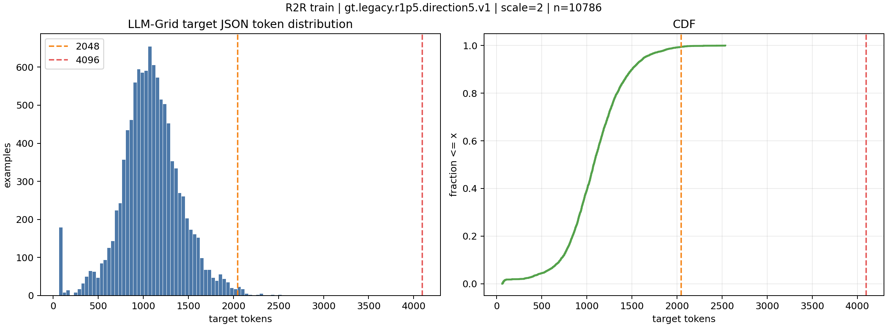

# 基于指令的先验认知地图 Instruction-based prior

## 方向

- 方向 1：基于指令的先验认知地图
    - 寻找/调研 benchmark：**训练物体种类/实例** (材质等属性) (**24、25 最常用的数据集**的参考附录、自己分析、AI 辅助检索分析)；数据集指令详细程度
    - 概率认知地图形式：查询现有工作
    - Indoor Benchmarks / Datasets
        - R2R (x1890, x411 this year): [Vision-and-Language Navigation: Interpreting Visually-Grounded Navigation Instructions in Real Environments CVPR 2018](https://openaccess.thecvf.com/content_cvpr_2018/html/Anderson_Vision-and-Language_Navigation_Interpreting_CVPR_2018_paper.html)
            - 21,567 **open**-vocabulary, crowd-sourced navigation instructions with an average length of **29 words**
            - 
        - R4R (x229): [[1905.12255] Stay on the Path: Instruction Fidelity in Vision-and-Language Navigation](https://arxiv.org/abs/1905.12255)
            - algorithmically produced extension of R2R
            - Stay on the Path
        - Landmark-RxR (x47): [Landmark-RxR: Solving Vision-and-Language Navigation with Fine-Grained Alignment Supervision](https://proceedings.neurips.cc/paper/2021/hash/0602940f23884f782058efac46f64b0f-Abstract.html)
            - 从 RxR 中拆分的子指令与子轨迹对
            - 
        - RxR (x441, x146 this year): [[2010.07954] Room-Across-Room: Multilingual Vision-and-Language Navigation with Dense Spatiotemporal Grounding](https://arxiv.org/abs/2010.07954)
            - multilingual (English, Hindi, and Telugu)
        - XL-R2R (x22): [[1910.11301] Cross-Lingual Vision-Language Navigation](https://arxiv.org/abs/1910.11301)
            - R2R + Chinese
            - 
        - REVERIE (x468, x144 this year): [REVERIE: Remote Embodied Visual Referring Expression in Real Indoor Environments](https://openaccess.thecvf.com/content_CVPR_2020/html/Qi_REVERIE_Remote_Embodied_Visual_Referring_Expression_in_Real_Indoor_Environments_CVPR_2020_paper.html)
            - 21,702 instructions and a vocabulary of over 1,600 words
            1. Fold the towel in the bathroom with the fishing theme.
            2. Enter the bedroom with the letter E over the bed and turn the light switch off.
            3. Go to the blue family room and bring the framed picture of a person on a horse at the top left corner above the TV.
            4. Push in the bar chair, in the kitchen, by the oven.
            5. Windex the mirror above the sink, in the bedroom with the large, stone fireplace.
            6. Could you please dust the light above the toilet in the bathroom that is near the entry way?
            7. At the top of the stairs, the first set of potted flowers in front of the stairs need to be dusted off.
            8. To the right at the end of the hall, where the large blue table foot stool is, there is a mirror that needs to be wiped.
            9. Go to the hallway area where there are three pictures side by side and get me the one on the right.
            10. There is a bottle in the office alcove next to the piano. It is on the shelf above the sink on the extreme right. Please bring it here.
        - CVDN (x444, x91 this year): [Vision-and-Dialog Navigation](https://proceedings.mlr.press/v100/thomason20a.html)
            - English, 2050 human-human navigation dialogs, comprising over 7k navigation trajectories punctuated by question-answer exchange
            - Oracle + Navigator
            - e.g.
                - Oracle: Through the lobby. So go through the door next to the green towel. Go to the left door next to the two yellow lights. Walk straight to the end of the hallway and stop...
                - Navigator: Are these the yellow lights you were talking about?
            - 
            - Task: Navigation from Dialog History (NDH)
        - VLN-CE (x438, x161 this year): [[2004.02857] Beyond the Nav-Graph: Vision-and-Language Navigation in Continuous Environments](https://arxiv.org/abs/2004.02857)
            - 4475 trajectories converted from R2R train and validation splits
            - each trajectory, we provide the multiple natural language instructions from R2R and a pre-computed shortest path following the waypoints via low-level actions
    - Outdoor Benchmarks / Datasets
    - Summary
        - [Vision-and-language navigation: A survey of tasks, methods, and future directions](https://aclanthology.org/2022.acl-long.524/) 
- 方向 2：提取半结构化场景中的指示性信息，用于 VLN
    - 路标+VLN：
        - [[2307.06082] VELMA: Verbalization Embodiment of LLM Agents for Vision and Language Navigation in Street View](https://arxiv.org/abs/2307.06082)
            - VELMA: verbalization of the trajectory + visual environment observations
            - Verbalization: extracts landmarks from instructions; uses CLIP to determine visibility in the current view
        - [[2411.11507] SignEye: Traffic Sign Interpretation from Vehicle First-Person View](https://arxiv.org/abs/2411.11507)
            - New Task: TSI-FPV, traffic sign interpretation from the vehicle’s first-person view
            - Scenario application: traffic guidance assistant (TGA) in assisting ADS
            - reasoning pipeline (SignEye)
            - dataset (Traffic-CN)
        - [Traffic Sign Interpretation via Natural Language Description | IEEE Journals & Magazine | IEEE Xplore](https://ieeexplore.ieee.org/abstract/document/10609794)
            - Core: Recognize parts separately -> globally
            - Task: TSI
            - Arch: TSI-arch
            - Dataset: TSI-CN
        - [Guided by the Way: The Role of On-the-route Objects and Scene Text in Enhancing Outdoor Navigation | IEEE Conference Publication | IEEE Xplore](https://ieeexplore.ieee.org/abstract/document/10611727)
            - Core: utilizing reference landmarks
            - Model: Object-Attention VLN (OAVLN), focus on relevant objects during training and understand the environment better
            - Benchmark datasets: Touchdown and map2seq
- Idea
    - 概率认知地图形式 word embedding? 便于直接融合
    - 方向 1+2，指令+指示性信息的先验认知地图，或者进一步拓展支持更多
    - 先验认知地图训练时不一定直接去除无关元素的先验影响 (0/1)，可以降低权重；使用时也可以考虑动态权重，如与环境较为吻合则逐步提高权重，否则降低

## 背景调研

### 数据集

- 常用/今年引用次数：R2R, VLN-CE, RxR, REVERIE
- 与方法较为契合：R4R, CVDN (指令较长，涵盖信息更多？)
- [R2R](https://bringmeaspoon.org/): Need contact
- [R4R](https://github.com/google-research/google-research/tree/master/r4r): Generated from R2R
- [MP3D](https://ar5iv.labs.arxiv.org/html/1709.06158) | [Web page](https://niessner.github.io/Matterport/)
    - The 3D segmentations contain a total of 50,811 object instance annotations. Since AMT workers are allowed to provide freeform text labels, there were 1,659 unique text labels, which we then post-processed to establish a canonical set of 40 object categories mapped to WordNet synsets.
    - 

### 语义地图

- [Cross-Modal Map Learning](https://github.com/ggeorgak11/CM2/) ([Chat](https://github.com/copilot/c/31f5e05e-8c5b-4960-aa4d-0333c989a87b))
    - Spatial map: **3D float tensor** (spatial_labels × height × width) representing probability distributions over semantic classes at each spatial location
        - 3 spatial labels: void, occupied, free
    - Object map: **3D float tensor** (object_classes × height × width)
        - 27 object classes
        - [Code details](https://github.com/ggeorgak11/CM2/blob/4730cfdf49c468d6632fff03ecc9cee9955e7dee/datasets/util/viz_utils.py)
- [Weakly-Supervised Multi-Granularity Map Learning](https://github.com/PeihaoChen/WS-MGMap/): **3D float tensor** `(channels, height, width)` where each channel represents probabilities for different semantic categories ([Chat](https://github.com/copilot/c/592d24c4-cfb3-48c9-b429-bc877b56f479), [Paper](https://ar5iv.labs.arxiv.org/html/2210.07506))
    - Channels: occupancy map + explored map + 27 object categories = 29 channels

## Impl

### 认知地图细化

- 标签
    - 是否修改 40 -> 27 的**物体**标签映射
    - 是否增加**区域**标签
- 尺寸
    - Cross-modal Map Learning：自我中心的局部地图
    - 考虑采用第三方视角下的全局地图
        - 根据 agent 坐标将其放置于全局地图中，然后输出当前起点**出发**的局部认知地图 (轨迹附近的地图)
        - 其它 paper：自我**中心**的局部地图，视角中心朝上
        - 第三方视角：固定视角的大全局地图，记录机器人视角
- 认知地图 Ground-Truth 构造方式
    1. 认知地图与语义地图
        1. 语义地图：占用地图 (free, occupied) + 区域的语义信息 (输入 RGBD，精确的)
        2. 认知地图：仅输入指令，只有大概的语义信息 (模糊的，大概的)
    2. 每个场景一个全局语义地图
    3. 根据 prompt 和轨迹，各轨迹点附近 ($\Delta x, \Delta y<\sigma$) 的物体加入局部语义地图
    4. 3 中的局部语义地图 -> 认知地图
    5. 累加指令的轨迹序列，每一步构造 GT，进行迭代训练 (implementation，待考虑)
- 考虑后续流程
    - 要求输入一条指令，可以输出对应认知地图 -> 需要有这样一一对应的 GT
    - 要求针对同一场景，可以不断输入指令，生成逐渐完整的认知地图 -> 需要有这样渐次对应的 GT
        - 上一步输出/GT 认知地图 + 新的指令 -> 新的认知地图
        - 训练需要的信息：(指令的集合, 叠加的认知地图)
        - 执行指令时获得的观察：(optional) 更新上一步的认知地图
    - 对同一场景，不同指令的输入顺序应当为不固定的 -> 渐次对应的 GT 设置中，需要方便地取出任意指令组合的认知地图
        - 重点
- Idea：一个指令一个认知地图，多个指令组合则概率叠加
    - 多个实例？
    - 平均/加权？
        - 权重的确定？
        - 后来的指令还是之前的指令权重大？
        - map = (map + new_map) / 2 迭代，方便渐进式计算？
- **考虑类别映射**？
    - 删除出现较少的
    - 墙、门、窗户的区别映射
    - 区域标签

### 工作介绍

- 想法：根据指令预先构造对场景的“想象”，并在后续探索过程中不断优化
- 概念
    - 认知地图
        - 基于指令和观察，生成局部认知地图
        - 局部认知地图拼成全局认知地图
    - 语义地图 / Ground-Truth 认知地图
        - 通过场景的标注信息构建全局语义地图
        - 从中取一部分 (轨迹点邻域)，得局部语义地图

## 结果对比

### 地图编码器 GT

| Method                     | SR         | OSR        | SPL        | ckpt    |
| -------------------------- | ---------- | ---------- | ---------- | ------- |
| Baseline (Dagger)          | 0.6313     | 0.6852     | 0.5423     |         |
| Baseline (GRPO)            | 0.6536     | 0.7151     | 0.5582     |         |
| Baseline (Partial, dagger) | 0.5568     | 0.6253     | 0.4728     |         |
| Ours (FT only, GRPO)       | 0.6487     | 0.7151     | 0.5519     |         |
| Try 3 (Dagger)             | 0.5905     | 0.6542     | 0.4985     |         |
| Try 3 (Partial, dagger)    | 0.5525     | 0.6183     | 0.4667     |         |
| Try 4 (Dagger)             | 0.6444     | 0.7172     | 0.5302     | 27800   |
| Try 4 (GRPO)               | 0.6455     | 0.7080     | 0.5542     | 270     |
| Try 5 (VLNCE, Dagger)      | 0.7304     | 0.7602     | 0.6498     | 27800   |
| **Try 5 (VLNCE, GRPO)**    | 0.7401     | 0.7809     | 0.6506     | 350     |
| Try 5 (Dagger)             | 0.7265     | 0.7591     | 0.6305     | 27400   |
| Try 5 (GRPO)               | 0.7417     | 0.7830     | 0.6304     | 420     |
| Try 6 (Dagger)             | 0.6449     | 0.6835     | 0.5609     | 27800   |
| Try 7 (Dagger)             | 0.6520     | 0.7230     | 0.5450     | 29600   |
| Try 8 (Dagger)             | 0.6400     | 0.7025     | 0.5382     | 26800   |
| Try 9 (Dagger)             | 0.6378     | 0.6965     | 0.5394     | 28800   |
| Try 10 (Dagger)            |            |            |            |         |
| Try 5 (Dagger, r=1.5)      | **0.7656** | **0.7896** | **0.6682** | 25600   |
| Try 5 Like 2x (Dagger, r=1.5) | 0.6917  | 0.7221     | 0.5988     | 29800   |

- Try 4 (reuse+full, new-model-full)
    - [新的地图编码器结构](https://github.com/PRO-2684/ETP-R1/commit/8b7c5763f06156581b59d871e2afaaf4131aad3a) V2 (ResNet-like)
    - [新增 `direction_vectors` & `start_position`](https://github.com/PRO-2684/ETP-R1/commit/c445ac01a7ee5256f168dafbcc6d929027e30524)
    - 复用作者权重
    - 完整数据
- Try 5 (try5)
    - 新的地图编码器结构 V3 (参考 Imagine Before Go)
        - Starting from `7de636b53f02a8d96e2457f03742ea5370527944`
    - 新增 [`start_direction_vector`](https://github.com/PRO-2684/ETP-R1/commit/e8a4d1210b7b815104dfd66dd25c2f12183c296c)
    - VLNCE variant: 预训练只使用 VLNCE 标注数据，未使用作者的增广数据
        - (new-vlnce-only, try-5-vlnce)
    - 实现有问题：没有单词向量相似度匹配，于 [`8189627`](https://github.com/PRO-2684/ETP-R1/commit/81896270673eb6ccd67ea375c97375d9878b7863) 修复
    - **Lesson: 多参考已有工作**
- Try 6 (try6, [`705dd7b`](https://github.com/PRO-2684/ETP-R1/commit/705dd7bd5977238d4b7da02c35a6235189932ec5))
    - 基于 bounding box 的 gt 认知地图
    - 半径：2.5m -> 1.5m
    - Waypoint：GT (稠密) -> Reference (稀疏)
    - *数据增强：随机旋转 (90° 整)*
    - `direction_vectors` -> `reference_path`
- Try 7 (try7, `d7f681b`, @超算)
    - 重新使用 GT 路径
    - 如果第一个遇到的楼层路径点不足，使用其它楼层
- Try 8 (`2b3d97d`, @VIPL&超算)
    - 禁用随机旋转
    - 加入拓扑地图 -> 认知地图的 attn
- Try 9 (`9caeb61`, @VIPL)
    - 简易的认知地图 Decoder
- Try 10 (`0a31d47`, @VIPL)
    - DETR-style Decoder
- Try 5, r=1.5 (`121c369`)
- Try 5 Like, 2x blurred (`6ce1e4a`)
    - 模型：带双向 attn 和 DETR-style Decoder
    - GT: legacy, direction-vectors, 1.5m

### 地图预测器 - 弃用

| Ver | Commit                                                                                          | prob_pos | prob_neg | top1pct_recal | top5pct_recall |
| --- | ----------------------------------------------------------------------------------------------- | -------- | -------- | ------------- | -------------- |
| v1  | [`1b40047`](https://github.com/PRO-2684/ETP-R1/commit/1b40047faeb019003d99206b68207061997f7952) | 0.466    | 0.0209   | 0.446         | 0.774          |
| v2  | [`7c3efa3`](https://github.com/PRO-2684/ETP-R1/commit/7c3efa3efab807950b50ea9e896f0970cf2df4e8) | 0.65423  | 0.01404  | 0.73828       | 0.94925        |
| v3  | [`705dd7b`](https://github.com/PRO-2684/ETP-R1/commit/705dd7bd5977238d4b7da02c35a6235189932ec5) |          |          |               |                |

- v1: Init
- v2: 加入 Metadata (`start_position`, `start_direction_vector`)
- v3: GT 为 Try 6

#### 解释

- `loss`: training objective value. Lower is not always better for map quality because weighted BCE can reward broad positive predictions.
- `mae`: mean absolute error between sigmoid(logits) and GT map values. Can look good even for bad sparse maps because most cells are background.
- `target_pos`: fraction of GT cells that are positive. Example 0.002 means only 0.2% of all category/grid cells are positive.
- `prob_mean`: average predicted probability over all cells.
- `prob_max`: max predicted probability anywhere.
- `prob_pos`: average predicted probability on GT-positive cells. Higher is good.
- `prob_neg`: average predicted probability on GT-negative cells. Lower is good.
- `pred_pos@T`: fraction of cells predicted positive after threshold T. If this is much larger than `target_pos`, model is overpredicting.
- `precision@T`: among predicted-positive cells, fraction that are correct. Higher means fewer false positives.
- `recall@T`: among GT-positive cells, fraction recovered. Higher means fewer missed positives.
- `iou@T`: intersection-over-union after threshold T: TP / (TP + FP + FN). This balances precision and recall. For sparse maps, IoU is harsh.
- `top1pct_recall`: recall captured if you only keep top 1% highest-probability cells. Measures ranking quality independent of fixed threshold.
- `top5pct_recall`: same, but keeping top 5% cells. Useful when logits are poorly calibrated but spatial ranking is meaningful.

Main reading:

- High `prob_pos` vs low `prob_neg` means model knows where positives tend to be.
- High `top5pct_recall` means ranking is useful.
- Low iou with high recall and low precision means model predicts too broadly.
- Best threshold being high, e.g. 0.5, means raw probabilities are overconfident/broad and need stricter cutoff or better calibration.

### Imagined - 弃用

| Method                | Commit                                                                                                            | SR     | OSR    | SPL    | ckpt |
| --------------------- | ----------------------------------------------------------------------------------------------------------------- | ------ | ------ | ------ | ---- |
| Baseline (Dagger)     | /                                                                                                                 | 0.6313 | 0.6852 | 0.5423 |      |
| Baseline (GRPO)       | /                                                                                                                 | 0.6536 | 0.7151 | 0.5582 |      |
| Img 1 (Dagger)        | [`35e987a`](https://github.com/PRO-2684/ETP-R1/commit/35e987abe3062baf6ba92d0724fd21a8d4242d7d)                   | x      | x      | x      | x    |
| Img 1 (VLNCE, Dagger) | [`76d06ec`](https://github.com/PRO-2684/ETP-R1/commit/76d06ecdacfe6ca873f79b08b69c43218ed3e9ac)<br>(-> `fed01c3`) | x      | x      | x      | x    |
| Img 2 (Dagger)        | x                                                                                                                 | x      | x      | x      | x    |
| Img 3 (Dagger)        | `8390ae1`                                                                                                         |        |        |        |      |

- Img 1: Predictor v2; Based on author's pretrain weight
    - Ref OccWorld model ([Option 2: Better, OccWorld-Style Latent Map Prior](#Option%202%20Better,%20OccWorld-Style%20Latent%20Map%20Prior))
- Img 2: Predictor v2; Load predictor weight `img2.predictor.pt`; Load baseline weight
- Img 3: Predictor v3; Predictor weight from 0.

### 基于 LLM 的预测器

| Method | Commit | E-valid | IoU | Cat Precision | Cat-F1 |
| - | - | - | - | - | - |
| LLM 1  | `1e8b031` | 99.98%  | 0.121% | 1.28%  | 0.34%  |
| LLM 2  | `4ec2b81` | 99.42%  | 1.42%  | 67.53% | 56.26% |
| LLM 3  | `92d2476` | 94.17%  | 2.22%  | 26.18% | 33.90% |
| LLM 4  | `4e9a456` | 94.22%  | 1.31%  | 18.72% | 23.43% |
| LLM 5  | `42c16c8` | 95.24%  | 1.76%  | 23.06% | 29.42% |

- LLM 1: Tell2Design-style
    - e.g. `[ object appliances | center x = 14.0 | center z = 26.9 | half x = 1.2 | half z = 0.3 | rotation = -2.55 ]`
    - 问题：过长导致截断
- LLM 2: 更简短的输出格式
    - e.g. `obj door 25.1 29.0 1.1 0.2 -2.87`, `reg circulation 26.5 22.2 35.0 37.6`
    - 仅考虑 mentioned
- LLM 3: Llama-based
    - rank = 8
- LLM 4: Use GT path
    - rank = 32
    - 如果第一个遇到的楼层路径点不足，使用其它楼层
    - 随机旋转
    - -> 生成的预训练 navigation cache 仅 8621/109507
- LLM 5: 禁用随机旋转
    - -> ?

### 基于 LLM 的 pipeline

- Smoke: LLM-derived cognitive-map cache + Try 7 navigation checkpoint
    - Script: `scripts/tries/smoke-llm-map-try7.sh`
    - Matrix: LLM4 cache, LLM5 cache
    - Checkpoint: `data/logs/checkpoints/release_r2r_priorgt_dagger/store/try7.iter29600.pth`
    - R2R evaluation only for the first smoke pass
    - Shared VLN-CE episode iteration filters to English instructions
    - Training skips missing LLM-Navigation `.npz` cache entries
    - Evaluation treats a missing `.npz` as an LLM generation failure:
        - keep the episode in the denominator
        - assign zero navigation metrics
        - report `llm_cache_missing_count` / `llm_cache_missing_rate`
    - SR 46.43%; Missing cache 26.48%; SR in entries with cache 63.17%
- Nav 1: Try 8 + LLM 5
    - 未完整运行 - 检查点丢失
- Nav 2: Try 9 + LLM 5
    - 未完整运行 - 中断，运行 try5-r1p5

## 阶段

### 🟢 阶段一：预实验，验证可行性

- 从场景中根据标注建立认知地图 GT (语义地图)
    - [x] 确认尺寸大小是楼层大小还是建筑大小：建筑大小
        - [x] 改为**各楼层的平均**？**按楼层直接平均**，还是建筑内平均后再按建筑平均？ - 50m x 50m 仍然可行
    - [x] 全局地图的 ROWS, COLS
        - 尺寸约 50m
        - 确定物体尺寸分布以确定精度
        - CM2 局部地图: 5cm 精度，9m 大小
        - 考虑 10cm 精度，500 x 500
    - [x] 超出 ROWS, COLS 的部分：裁剪？中心/**边角**？
    - [x] 局部地图的 ROWS, COLS - 等同于全局
    - [x] 区域类型映射
    - [x] 多楼层的处理：一个数组 LEVELS x CHANNELS x N x N
- GT 语义地图 -> GT 认知地图 (提取相关物体/区域，降低其余权重)
    - 一条指令 -> 一个 GT 认知地图
    - 多条指令 -> 合成一个 GT 认知地图
- VLN 任务中利用 GT，观察成功率等指标是否有提升
    - 如何利用？基于现有工作？


- [ ] 各 level 的 height 数据表现异常 - 忽略？
    - `python3 -m prior.analyze.level_height_wtf`
    - Level 0: 20.03m x 20.82m, with height 15.43m
    - Level 1: 41.52m x 36.18m, with height 16.08m
    - Level 2: 41.74m x 25.06m, with height 14.20m
    - Level 3: 21.71m x 15.05m, with height 13.24m
- [x] 坐标系统不一致
    - `SemanticScene`, branch `main`: xyz - width, depth, height
        ```python
        aabb = level.aabb
        # AABB.size() returns a Vector3 with (x, y, z) dimensions
        size = aabb.size()  # type: ignore
        width = size.x  # x dimension
        depth = size.y  # y dimension
        height = size.z  # z dimension as vertical
        ```
    - Simulator, branch `use-sim`:
        ```python
        aabb = level.aabb
        # AABB.size() returns a Vector3 with (x, y, z) dimensions
        size = aabb.size()  # type: ignore
        width = size.x  # x dimension
        depth = size.z  # z dimension
        height = size.y  # y dimension as vertical
        ```
    - 结果均为：
        ```shell
        $ python3 -m prior.analyze.level_height_wtf
        Level 0: 20.03m x 20.82m, with height 15.43m
        Level 1: 41.52m x 36.18m, with height 16.08m
        Level 2: 41.74m x 25.06m, with height 14.20m
        Level 3: 21.71m x 15.05m, with height 13.24m
        ```
    - 查询 CPP 源码：
        ```cpp
        static bool loadMp3dHouse(
            const std::string& filename,
            SemanticScene& scene,
            const Magnum::Quaternion& rotation =
                Mn::Quaternion::rotation(geo::ESP_FRONT, geo::ESP_GRAVITY)
        );
        ```
    - 查询相关文档，转译为 Python (Python 的 IDE support 实在烂中烂，habitat-sim 和 magnum 的文档也烂)：
        ```python
        # constants.py
        from magnum import Quaternion, Vector4
        from habitat_sim.geo import FRONT, GRAVITY

        _HABITAT_MP3D_ROTATION_QUATERNION = Quaternion.rotation(FRONT, GRAVITY)  # type: ignore
        HABITAT_MP3D_ROTATION_VECTOR = cast(Vector4, _HABITAT_MP3D_ROTATION_QUATERNION.xyzw)  # type: ignore

        # Usage:
        from habitat_sim.scene import SemanticScene
        from prior.constants import HABITAT_MP3D_ROTATION_VECTOR

        SemanticScene.load_mp3d_house(house_file, scene, HABITAT_MP3D_ROTATION_VECTOR)
        ```
    - 结果：
        ```shell
        $ python3 -m prior.analyze.level_height_wtf
        Level 0: 20.82m x 20.03m, with height 15.43m
        Level 1: 36.18m x 41.52m, with height 16.08m
        Level 2: 25.06m x 41.74m, with height 14.20m
        Level 3: 15.05m x 21.71m, with height 13.24m
        ```
- [x] 坐标为负数 - 如何处理？Offset 值？
    - 按照 aabb 平移
- [x] 3D 物体/区域 -> 2D 图？
    - Regions: **直接按照 aabb 填充**
        - `contains` 失效
        - `floor_height`, `extrusion_height` 总为 0
        - `volume_edges`, `poly_loop_points` 总是为空
    - Objects 不能向 regions 一样直接 aabb，否则过于粗糙 (当前实现)；考虑 aabb 内检查是否 `contains()` (contains 貌似总是 False?)
        - 取中间切片并离散化，检查是否 `contains()`
        - 特定高度间隔切片并离散化，检查是否 `contains()`
        - obb contains
- [x] 无法读取 objects?
- [ ] 层级关系：Region -> Objects，是否可以利用？
- [ ] Regions 更精细的做法？
- [x] GT 认知地图构建
    - [x] MP3D 指令数据集？
        - [R2R](https://bringmeaspoon.org/) - 找不到下载链接；基于 Matterport3DSimulator，[需要考虑坐标变换](https://github.com/facebookresearch/habitat-sim/issues/2549)
        - [R2R ported to habitat-sim](https://jacobkrantz.github.io/vlnce/data#:~:text=ported%20from%20the%20Matterport3D%20Simulator%20to%20the%20Habitat%20Simulator)
    - [x] Region 构建
    - [x] 单复数？同义词？
        - Embedding cosine similarity, $<thrsh$: other
            - **先实验可行性**
            - 鞋/鞋柜
            - 阈值？
        - LLM + Prompt
- [x] 高斯平滑
    - 高斯混合模型？
        - 物体形状不符合“椭圆形”的假设
        - GMM 需要预先确定类别数
        - 没有现成的在网格地图上的 GMM 实现
        - [mit-lean/GMMap](https://github.com/mit-lean/GMMap)？
    - 聚类的类别数？(贝叶斯高斯？)
    - **高斯模糊**？
- [x] CLIP 编码文本标签 -> LABELS x W x H x 512 -按概率加权> W x H x 512
    - 直接使用底层 LLM 的编码器？
- [x] 融合导航框架
    - Sota? [ChatGPT - Research: Academic, Paper, Scholar, Report](https://chatgpt.com/g/g-eMiB710xd-research-academic-paper-scholar-report/c/69ad7a11-ee50-832f-bf5b-1e40b3f59240)

### 阶段二：认知地图的构建

- 如何“拼成全局认知地图”？
- 没有认知时所有取 0 还是取 1/channels？需要保证和为 1 吗？
- ...

### 阶段三：指令 -> 认知地图模型训练

- ...

## 拓扑地图/草绘图相关工作

- [Inferring Maps and Behaviors from Natural Language Instructions](https://elicit.com/review/f4392dfe-4af6-48a2-8892-0befab569329/source/ss-16096595): 思路相似
    - [Learning Semantic Maps from Natural Language Descriptions](https://dspace.mit.edu/handle/1721.1/87051)
- [Following directions using statistical machine translation](https://elicit.com/review/f4392dfe-4af6-48a2-8892-0befab569329/source/ss-11932171): 通过机器翻译的方法实现 "语言指令 -> 结构化指令"
- [Language to Map: Topological map generation from natural language path instructions](https://elicit.com/review/f4392dfe-4af6-48a2-8892-0befab569329/source/ss-268510295): 语言指令 -> 拓扑地图
- [From descriptions to depictions: A dynamic sketch map drawing strategy](https://elicit.com/review/f4392dfe-4af6-48a2-8892-0befab569329/source/ss-2742664): TODO
- [From Descriptions to Depictions: A Conceptual Framework](https://elicit.com/review/f4392dfe-4af6-48a2-8892-0befab569329/source/ss-8452687): TODO
- Robot Navigation in Unseen Environments using Coarse Maps
    -  Coarse Map Navigator
- FloNa: Floor Plan Guided Embodied Visual Navigation
    - GT SR ~60%, $F^3$ SR 低
- Mobile Robot Navigation Using Hand-Drawn Maps: A VisionLanguage Model Approach
    - SR ~80%
    - 问卷调查比较结果
- SkeNa: Learning to Navigate Unseen Environments Based on Abstract Hand-Drawn Maps
    - Ray-based Map Descriptor: 通过各角度的射线长度描述地图特性

- 指令 -> 拓扑图 -> 导航 (已有相关工作)
- 指令 -> 草绘图 -> SkeNa/Coarse Map Navigator (角度/旋转的影响？距离不准确？)
- 指令 -> 拓扑图 -> 草绘图 -> 导航

# 讨论与结果

## 04/30

### VLN 训练范式

- [x] 认知地图网格数据形式
    - [x] 网格
        - 直接给模型 (计算量？)
        - 只取最大置信度的
        - 加权：需要检查 embedding 加权结果对应的词汇 (`Conv2d(37, 512, kernel_size=1)`)
    - 起始位置
    - 方向向量
- [x] map encoder 模型结构？(寻找已有类 pointnet 的 backbone)
    - CLIP embedding
    - ResNet-Like
- [x] 训练
    1. 利用已有权重
    2. 预训练 map encoder
        - 部分数据 (R2R, RxR)
        - 全部数据 (+annotation)
    3. Dagger
    4. GRPO

TODO

- [x] 修改地图编码器的模型
- [x] 生成带有起始位置和方向向量的认知地图
- [x] 将起始位置和方向向量接入 pipeline
- [x] 从作者的权重开始预训练
- [x] 微调

### 认知地图生成器的训练 (指令 -> 地图)

- 结构
    - **多模态大模型微调**
    - 世界模型的训练 (大模型常识的利用？)

### Online 双地图更新

视觉观察的物体映射至网格，加入认知地图/删除错误部分

### 认知地图轨迹半径

预测置信度网格->生成 embedding 网格

## 05/06

- [x] 传入朝向
- [ ] paper 1 ([Imagine Before Go](https://github.com/sx-zhang/SGM)) 参考 pipeline 结构
    - [ ] tokenize (encoder decoder)
    - [ ] LLM 常识注入与融合
    - [x] map encoder 参考：文本 RoBERTa 编码，图像通过 ViT 多个 Transformer block 编码 (只编码可见部分)
- [x] paper 2 ([OccWorld](https://github.com/wzzheng/OccWorld)) 参考：
    - (delta x, delta y) -> 方向向量
    - 衡量是否去除时间融合 self-attention
    - 模型结构对保留同一场景其它指令的认知地图是否有影响？(有利于持续进化)
- [x] 生成认知地图：传入所有信息
    - 认知地图
    - ...
- [ ] 是否可以收敛？无法收敛则考虑修改损失函数。

## 05/08

- [x] * 原文 grpo 为什么只更新两个模块？grpo 是否需要冻结地图编码器？
    - GRPO_trainer_ETP_R1.py
    - `def setup_training_parts(self):`
        - 冻结 `self.policy`
    - `self.trainable_parts`
        - vln_bert_module.global_encoder
        - vln_bert_module.graph_query_text
        - vln_bert_module.graph_attentioned_txt_embeds_transform
        - vln_bert_module.global_sap_head
    - 目前 map encoder 在 GRPO 已经是冻结的 - 作者先冻结所有权重，再启用上面的模块
- [x] 涉及多楼层的数据比例？(先仅统计 R2R, RxR)
- 若多楼层，方向向量加一维？

### 多楼层调研

| Dataset                         | Entries | Up/down stairs  | Avg. positions |
| ------------------------------- | ------- | --------------- | -------------- |
| VLNCE-R2R                       | 13436   | 1024 (7.62%)    | 38.31          |
| VLNCE-RxR                       | 51139   | 6643 (12.99%)   | 68.32          |
| ETP-R1-R2R_Prevalent            | 1069620 | 131658 (12.31%) | 6.06           |
| ETP-R1-R2R_Prevalent_gemini_aug | 1046280 | 122647 (11.72%) | 6.06           |
| ETP-R1-R2R_train                | 14039   | 2672 (19.03%)   | 6.00           |
| ETP-R1-R2R_val_unseen           | 2349    | 516 (21.97%)    | 5.97           |
| ETP-R1-rxr_marky                | 1001331 | 244833 (24.45%) | 10.50          |
| ETP-R1-rxr_train_guide          | 79467   | 17681 (22.25%)  | 9.08           |
| ETP-R1-rxr_val_unseen_guide     | 13652   | 3474 (25.45%)   | 8.52           |

### 微调阶段可训练/冻结的模块

#### Author ETP-R1

In DAgger (SS-ETP-R1), almost the whole policy is trainable. The trainer freezes only the waypoint predictor explicitly, then builds the optimizer
over self.policy.named_parameters() vlnce_baselines/ss_trainer_ETP_R1.py:224 vlnce_baselines/ss_trainer_ETP_R1.py:237. Inside the model, RGB CLIP is
frozen, depth encoder is frozen by default, and fix_lang_embedding / fix_pano_embedding can freeze VLN-BERT language or pano embeddings, but in
run_r2r/iter_train.yaml both are False, so they train.

In GRPO (GRPO-R1), the trainer first freezes the whole policy, then unfreezes only these VLN-BERT navigation modules vlnce_baselines/
GRPO_trainer_ETP_R1.py:229:

- vln_bert.global_encoder
- vln_bert.graph_query_text
- vln_bert.graph_attentioned_txt_embeds_transform
- vln_bert.global_sap_head

Everything else stays frozen: language encoder, panorama/image embedding path, RGB/depth encoders, waypoint predictor, etc. The optimizer is built
only from requires_grad=True params vlnce_baselines/GRPO_trainer_ETP_R1.py:319.

#### Our ETP-PriorGT

In DAgger (SS-ETP-PriorGT) with normal config, it trains the same broad policy surface as ETP-R1 DAgger, plus the new map_encoder. The optimizer
filters to p.requires_grad, and map_encoder params are trainable by default vlnce_baselines/ss_trainer_ETP_PriorGT.py:244. If
MODEL.MAP_ENCODER.freeze_base=True, PriorGT DAgger freezes every policy parameter whose name does not include map_encoder, so only the map encoder
trains vlnce_baselines/ss_trainer_ETP_PriorGT.py:232.

In GRPO (GRPO-ETP-PriorGT), current code follows the author GRPO setup: it freezes the whole policy, then unfreezes only the same four VLN-BERT
navigation modules vlnce_baselines/GRPO_trainer_ETP_PriorGT.py:219 vlnce_baselines/GRPO_trainer_ETP_PriorGT.py:286. That means our map_encoder is not
trained during normal PriorGT GRPO. It is used to produce map_embeds, but its weights stay fixed from the loaded DAgger checkpoint.

One important caveat: GRPO-ETP-PriorGT has a freeze_base probe block, but it runs after the optimizer was already built and after
setup_training_parts() froze the map encoder. As written, freeze_base=True in GRPO does not actually make map_encoder trainable. The DAgger probe path
is correct; the GRPO probe path would need a small fix if we want “train map encoder only” during GRPO too.

## 05/13

- ~~统计涉及楼层数量分布~~ / 统计各场景楼层数量
    1. 29
    2. 34
    3. 18
    4. 7
    5. 1
    6. 1
- 认知地图 3 个楼层（最底下） (upd 05/16)
    - **参考现有工作的多楼层处理**
    - 起始楼层开始
    - 空间顺序排列
    - 单层：一层为空？上/下？
    - 层数 F=3 的处理？B x F x N x 100 x 100
        - **放到 embedding 里 (B x FN x 100 x 100)**?
            - 可能的问题：多层被压到一层里了 (FD -> D)，无法确认出现的物体在哪一层
        - 层数放到 Batch Size 里？(BF x N x 100 x 100)

## 认知地图生成

- predicts grid, but metadata?
    - zero

### Option 1: Simple Direct Decoder

Fastest to implement. Architecture:

VLN text embeddings or CLIP text embedding + learned 10x10 query tokens + metadata query
-> 2-4 Transformer decoder layers
-> upsample CNN head
-> logits (37,100,100)

Train against PrecomputedCognitiveMap.grid. Loss:

- BCEWithLogitsLoss if grid is multi-hot
- CrossEntropyLoss if one category per cell
- weighted/focal loss for rare objects
- optional Dice/IoU loss for spatial quality

Then:

```python
pred_grid = torch.sigmoid(logits)
map_tokens, map_masks = map_encoder(
    pred_grid,
    direction_vectors,
    start_direction_vectors,
    start_positions,
)
```

### Option 2: Better, OccWorld-Style Latent Map Prior

Use OccWorld idea: VQ-VAE compresses maps, transformer predicts latent codes.

Stage 1:

grid (37,100,100)
-> VQ-VAE encoder
-> discrete latent grid, e.g. (10,10)
-> VQ-VAE decoder reconstructs grid

Stage 2:

instruction tokens
-> transformer
-> predict VQ code IDs for 10x10 latent map
-> VQ decoder
-> predicted grid

Why better:

- avoids blurry map logits
- predicts structured layouts
- cheap autoregressive or masked-token training
- aligns well with our 10x10 map-token encoder

This mirrors OccWorld-main/model/TransVQVAE.py: encode occupancy to VQ codes, transformer predicts future codes, decoder reconstructs occupancy.

### Option 3: Best If Partial Map Exists

> “持续进化/学习”

If agent has observed partial map, use SGM-style masked reconstruction:

partial semantic map + mask
-> ViT/MAE map encoder
instruction/category text tokens
-> cross-attention
-> reconstruct unknown map cells

This matches SGM-main/SGM_train/models_mae_cross.py:

- ViT patch tokens from semantic map
- RoBERTa/category context
- Cross_model cross-attention
- decoder reconstructs masked map patches

For VLN this is stronger than instruction-only because partial observation anchors layout.

## 05/16

- ~~训练时 GT 路径添加随机偏移？？~~
    - `start_position`?
- [x] **生成时输入 metadata** (方向、位置)
- [x] 生成认知地图：考虑最先经过的一层，而非经过的最下面一层
- 循环式生成认知地图：借鉴 Imagine before go
    - 生成认知地图的代码搬过来 (`prior`)，实现在线生成？
    - 两个地图每格取 max？楼层？
- 新的认知地图生成流程
    - [x] 建模 90 个场景的 GT 语义地图 (0-1 格式)
        - [ ] 预生成
        - [x] **on the fly**
    - [x] 根据轨迹+阈值取出局部语义地图 (0-1 格式) (**训练过程中**)
        - 方便调阈值
        - 若空，取底层 `gt_maps[0]`
    - [x] 高斯模糊局部语义地图，生成认知地图 (**训练过程中**)
        - 先 max 后高斯 vs 先高斯后 max
    - [ ] 输出格式 F x N x 100 x 100（参考语义分割 decoder?）

## 05/20

- 流程
    - 训练认知地图生成器
    - **使用认知地图生成器的结果训练 GT 模型 (预训练开始)**
    - 测试
- 指标
    - [x] **可视化**？
    - 方向向量的指标？
    - top5pct_recall 90% 如何计算？
- 生成
    - LLM 常识注入？
    - 微调大模型？
        - 输出：
    - 问题
        - 绝对位置
        - 稀疏
- 路线
    - 保留当前 GT 结构，处理稀疏问题
    - 修改 GT 结构，从根源避免稀疏问题
- **损失函数**
    - 目标：物体相对位置、方向
    - 参考语义分割的 loss 方法

## 05/21

- 给模型输入位置取整？
- Sample 10; npz -> json (砍掉模糊，polygon); LLM prompt & generate
- pipeline
    - [x] **预计算所有认知地图**?
    - [ ] grid -> json (polygon-based?)
- 预测 direction vectors -> 预测关键的 waypoint? 维度不用改。
    - [ ] prompt engineering
    - [ ] *较大转向的 waypoints，角度 ~36.7*
- 如何评价相对位置的正确性？（绝对位置无所谓）量化指标？
- Q:
    - ~~预计算所有认知地图~~ -> 预计算语义地图，动态生成认知地图
        - 生成确实快
            - 2-3min for all r2r/rxr, 202M
            - ??? for annotations, ???G
        - 修改简单
    - `reference_path` or `locations`?
        - `reference_path`: Only key waypoints
        - `locations`: Dense, step-level, gt
    - RxR 不使用 follower?
        - 缺 `instruction_tokens`
        - 语义不同?
    - 支持所有 `language`？
    - 物体也使用 aabb？

## 05/28

- LLM 微调
    - 8B 4090 ~2 天
    - 损失函数：token-level 交叉熵，和 gt json 比较
        - 参考 [aclanthology.org/2023.acl-long.820.pdf](https://aclanthology.org/2023.acl-long.820.pdf#page=6.86) 代码、参数与环境
    - 确定 prompt 模板？
- map predictor: 候选
- 参考
    - [LengSicong/Tell2Design](https://github.com/LengSicong/Tell2Design) | [paper](https://aclanthology.org/2023.acl-long.820.pdf)：基于 T5，seq-to-seq，没有 prompt
        - treat the instructions as the input sequence and consider bounding boxes of rooms as the target sequence
    - [HOUSETUNE paper](https://arxiv.org/pdf/2411.12279)：
        - no code
    - [ChatHouseDiffusion paper](https://arxiv.org/pdf/2410.11908)：
        - no code


- Questions
    - 两阶段
        - LLM-Boxes: train/evaluate T5 JSON generation for object/region boxes and ref path
        - LLM-Navigation: integrate into nav pipeline
    - T5 输入是否包含 dataset flag (r2r / rxr)? 包含。
    - LLM 训练时随机旋转：先不添加，能 work 后再添加。
    - **仅考虑 mentioned???** (与 GT 实验不同)
-

## 06/05

- [x] `reference_path` (x) -> gt path 计算出转折点/key waypoint/bbox
- 半径：查看当前 LLM 微调结果
- eval：部分数据
- 提升 rank：32/64？
- 第二阶段预训练不用增广数据
- 数据增强
    - GT：验证上限，无需增强
    - 训练：需要数据增强，学习方向无关性
- Questions
    - trajectory_keypoints 包含最后一个位置
    - trajectory_keypoint_mask
    - 地图编码器的 start_position - 预测路径还是 episode?
    - 预训练数据集的 path 是稀疏的，不是 ground_truth_trajectory
    - Rank-Stabilized LoRA？
    - 第一个遇到的楼层 ground_truth_trajectory 路径点个数 < 1
        - If another level has >=2 dense GT points: use that level.
        - If every level has <2 points: generation warns/skips that entry.
        - Training/direct cache loading can still fail unless explicitly in skip-generation mode.
        - -> generated=91479 skipped=9 for VLNCE
        - -> generated=3226159 skipped=579 for pretrain

## 06/11

- 评价指标？
- [x] **可视化 sample**
- 生成的地图 <-> 视觉构建的地图
- **确认当前只有一个认知地图解码器，是否可以说成视觉地图和认知地图有交互；没有的话加交互？**
    - step 0: 大模型预测的地图 0 -> action, 预测的认知地图 1
    - step 1: 预测的认知地图 1 -> action, 预测的认知地图 2
    - decoder 损失 参考现有工作（网格 vs 网格的稀疏问题；）
- Claims:
    - 🟢 feature-level interaction/fusion
        - We augment ETP-R1’s online topological map with an external cognitive map by encoding the cognitive map as spatial-semantic tokens and letting topological graph nodes attend to those tokens. This enables feature-level interaction between the original topological planning representation and our semantic cognitive-map prior.
    - 🔴 interactively update each other or co-evolve

## 06/22

- LLM 生成的 nav cache 合法的数量少
    - 预训练 8621/109507
    - 可能原因：**语言不是英语**
    - [x] 剔除非英语数据
- fail?
    - fallback 到原模型？
    - [x] 认为 LLM generation failure，记录 `llm_cache_missing_count/rate`
- 认知地图/拓扑地图交互
    - 之前：已有单向特征融合 (GraphMapCrossAttention)，可以表述为 A + B => A + B*
    - Implemented (try 8)：拓扑地图 -> 认知地图的 attn（双向 attn）
        - A: 认知地图 embedding；B: 拓扑地图 embedding
        - A* = A + map_residual(A <- B)
            - `map_from_graph_attention` + `map_residual_projection`
        - B* = B + graph_residual(B <- A*)
            - `graph_from_map_attention` + `graph_residual_projection`
        - 后续流程使用 B*
- 工作
    1. 认知地图训练的并行实验
        - LLM 微调结果 (llm 4/5?) -> try 7 dagger, 直接测试
    2. 加入认知地图的更新
        - 更新后的认知地图 embedding A* 接入解码器，解码成更新后的认知地图，用 GT loss 约束（每一步都约束并更新）
    3. 视觉拓扑图的前瞻更新
        - 确认拓扑图构造方法：每一步更新？
            - Imagine Before Go：网格地图的前瞻
            - 迁移到当前工作：拓扑图的前瞻
            - 构造方法：在线更新
            - 存储细节
                - `node_pos[vp]`: 3D simulator position (x, y, z)
                - `node_embeds[vp]`: panoramic embedding for that visited location, computed from avg_pano_embeds[i]
                - `node_stepId[vp]`: rollout step when the node was inserted
                - `node_stop_scores[vp]`: model’s STOP probability when at that node
                - `graph_nx`: NetworkX graph with weighted edges
                - `shortest_path`, `shortest_dist`: all-pairs shortest path/distance caches
        - 确认拓扑图是否有前瞻（预测，例如 Imagine Before Go）？没有前瞻则考虑加前瞻
            - 局部的单步前瞻/预测；ghost node
            - `vlnce_baselines/models/R1Policy.py:187`, `vlnce_baselines/models/graph_utils.py:69`
            - From the current panoramic RGB/depth observation, it predicts candidate waypoint directions/distances.
            - Internally this is a heatmap over 120 angle bins x 12 distance bins.
            - NMS keeps up to 5 candidate waypoints.
            - Each candidate becomes a possible ghost/frontier node with an estimated 3D position from current pose + predicted angle/distance.

## 06/23

- 认知地图 Decoder 路径
    - [Masked-attention Mask Transformer for Universal Image Segmentation](http://openaccess.thecvf.com/content/CVPR2022/html/Cheng_Masked-Attention_Mask_Transformer_for_Universal_Image_Segmentation_CVPR_2022_paper.html): 直接生成 mask
        - 重点：Transformer Decoder
        - feature 作为 k, v, N queries 解码出来 N 个特征 token，认为是 N 个 mask (可以为空)
        - MLP 向右预测 mask 类别，向下 mask embedding
        - pixel-level 特征和 mask embedding 相乘，得 N x H x W mask 形状
        - 丢弃空集
    - [Per-Pixel Classification is Not All You Need for Semantic Segmentation](https://proceedings.neurips.cc/paper/2021/hash/950a4152c2b4aa3ad78bdd6b366cc179-Abstract.html): mask query 分割
        - feature 作为 k, v, N queries 解码出来 N 个特征 token，认为各对应一个候选 mask
        - 实际输出是类别 logits 和二值 mask logits，不预测 bbox
        - Hungarian matching 基于类别、focal mask loss、dice mask loss
        - 若迁移到认知地图，需要 per-entity raster mask 作为监督目标
    - ⭐ [End-to-End Object Detection with Transformers](https://arxiv.org/abs/2005.12872)

## 06/24

- [x] Cache failure rate?
    - Episodes that fail pre-generation item construction
    - 更新输出结构以方便诊断
- [x] Nav 1: Try 8 (加 decoder 之前) 使用 LLM5 Nav Cache 训练并验证
- [x] 添加认知地图 Decoder

决策：

- MaskFormer 论文不是基于 bbox 计算损失，而是基于 mask query 和匹配后的 mask loss。
- 真正的 MaskFormer-style 监督需要 per-entity raster masks；当前认知地图只有 category-first dense grid，没有保存不同 entity 的独立 mask。
- per-entity raster masks 会改变认知地图存储格式，先记录为后续方向。
- 当前先实现简单替代方案：从 updated map tokens 解码完整 updated cognitive map logits，使用 dense BCE loss 对齐现有 `(37, 100, 100)` 认知地图。

## 06/26

- Decoder 可能是三条路：
    - 改变认知地图存储格式，重跑出来，用 DETR
    - 想办法生成 entity mask，用 MaskFormer
    - 保留认知地图存储形式，换成语义分割范式，例如 Segmenter
- 当前流程更像指称分割 (Referring Expression Segmentation)，解码的时候语言指令要不要送入到 Decoder?
    - Referring Expression Segmentation (RES) is a vision-language task: given an image and a natural-language phrase such as “the man in the red shirt” or “the dog under the table,” the model must output a pixel-level mask for the referred object.
    - A typical RES model has three parts: an image encoder, a text encoder, and a fusion/segmentation decoder that combines visual and linguistic features to produce a binary mask. Recent systems increasingly use transformer vision-language backbones and sometimes large multimodal language models. For example, LISA extends this idea to “reasoning segmentation,” where the query can be implicit and require world knowledge.

## 07/03

- Nav cache failure 常见的失败原因
    - unknown region category: 'structure';
    - unknown region category: 'void';
    - unknown region category: 'free-space';
    - unknown object category: 'free-space 2.1 2.0 1.9 1.4 4.1'
    - missing_trajectory_keypoints: refusing to generate cache without trajectory keypoints
- 其它观察到的问题
    - **过度重复**
        - `data/llm_navigation/llama-3.1-8b-instruct/pretrain/mixed/predictions/5q7pvUzZiYa/2675_0.txt`
        - `data/llm_navigation/llama-3.1-8b-instruct/pretrain/mixed/predictions/ur6pFq6Qu1A/827_0.txt`
- [x] 确认 try7 测试是否有旋转，开了的话重新测试 - 测试没有旋转
- Try 5 变量
    - 半径 2.5 -> 1.5
    - path-mask -> bounding box
    - `direction_vectors` -> `reference_path`?
    - 如果第一个遇到的楼层路径点不足，使用其它楼层的 fallback?
- 先保持模型结构，不要加 attn 和 decoder
- 8 卡比 4 卡慢？
- 实验：GT + LLM 训练 + Nav
- 并行实验与模型结构改进
- GT 为空：跳过？
- 实验
    1. 去掉“拓扑地图 -> 认知地图的 attn”，仅 GT+VLN
    2. ~~GT 认知地图生成：Try 5（2.5m 半径+按路径切）~~ -> on-the-fly
    3. ~~GT 认知地图生成：Try 5（1.5m 半径+按路径切）~~ -> on-the-fly
    4. GT 认知地图生成：bbox, 2.5m 半径

## 07/08

### 改进 LLM 预测？

> https://chatgpt.com/g/g-6a3dee67d7d88191b59bb4ccb82063b7-paper-chat/c/6a48f3a4-1f58-83ec-bc7f-32748234dfe7

- 部分数据期望输出过长导致截断，没有终止符，可能会让模型倾向于不输出终止符，从而导致重复
- 查看期望输出中是否有重复
- 施加重复惩罚
- 对比实验
    - rank:           8, 16, 32
    - target modules: q/v vs. q/k/v/o
    - format:         free text vs. navigation DSL
    - decoding:       unconstrained vs. grammar-constrained
    - termination:    normal EOS vs. EOS + record-repeat stop
- Reasoning/CoT?
- 参考文献
    - [Dense Coordinate-List Fine-Tuning Induces a Controllable Interference Surface in Vision-Language Models](https://arxiv.org/html/2606.14507v1): 微调 LLM 输出结构化信息，缓解输出尾部重复
    - [NaviLLM: Towards Learning a Generalist Model for Embodied Navigation](https://arxiv.org/html/2312.02010v3): VLN 任务中微调 LLM 输出结构化信息
    - [Uni-NaVid: A Video-based Vision-Language-Action Model for Unifying Embodied Navigation Tasks](https://arxiv.org/html/2412.06224v2): 有限长度的输出可能更容易学习 (3–6 actions / waypoints)
    - [NavGPT](https://ar5iv.labs.arxiv.org/html/2305.16986) / [NavGPT-2](https://arxiv.org/abs/2407.12366): Reasoning
    - [UIE: Unified Structure Generation for Universal Information Extraction](https://arxiv.org/abs/2203.12277): 统一的结构化输出框架
    - [GoLLIE: Annotation Guidelines improve Zero-Shot Information-Extraction](https://arxiv.org/abs/2310.03668): Prompt 中包含清楚的定义/规则很重要（角度、坐标、STOP...）
    - [PICARD: Parsing Incrementally for Constrained Auto-Regressive Decoding from Language Models](https://arxiv.org/abs/2109.05093): 渐进式解析输出，拒绝让输出无效的 token (SQL)
    - [Grammar-Constrained Decoding for Structured NLP Tasks without Finetuning](https://arxiv.org/abs/2305.13971): 约束输出的格式，格式可根据输入的不同动态调整（输入依赖型语法）
- 想法：让预测结果与 try5 类型的认知地图相匹配
    - 预测 bbox 后根据路径点切出来（仅保留路径点附近格子）
    - 问题：要不要在关键路径点之间采样模拟连续轨迹

### 讨论

- keypoints 不输出？改提示词？
- 考虑调大 rank，影响不会特别大
- 查看 GT 是否有终止符
- Try5 GT 让 LLM 预测网格物体种类+占用位置，顺序：
    1. 找 20 个 GT 网格（注意别同一个场景+不同指令，跨场景比较好），不压缩直接生成 GT 文本，看长度和琐碎程度（比如一般有几个物体，平均每个物体有多少网格、整个GT文本Tokenizer‌之后长度）
    2. 2 倍压缩之后，还是查看上述信息，然后决定要不要继续压缩
    3. 然后进行非压缩 or 2x 压缩的 LLM 微调实验 和 VLN+GT 上限实验（其中非压缩的 VLN+GT 实验已经做过了）

### 跟进 `a467f7e`

- 格式：`g 4 18 38 0.6` (grid category axis1 axis2 <confidence>)
- 分析结果
    - Scale 1 output: outputs/llm_grid_samples/20260708-053628-818288-gt.legacy.r1p5.direction5.v1-n20-s1
        - mean target tokens: 6029.4
        - max target tokens: 10347
    - Scale 2 output: outputs/llm_grid_samples/20260708-053628-924893-gt.legacy.r1p5.direction5.v1-n20-s2
        - mean target tokens: 2441.2
        - max target tokens: 3455
- 是否保留置信度？（未提及但是在附近的物体）
- 是否提升 max_tokens？
- Downsample 必要性？不如直接降低 VLN 模型的期望分辨率，而非预测低分辨率的然后缩放？

## 07/09

LLM-Grid token stats (`d071fe5`, 2x maxpool):

- Mean: 1084
- Median: 1076
- P95: 1637
- P99: 1957
- Max: 2536



## 07/10

LLM-Boxes token stats:

| split      | n      | mean | p50 | p90 | p95  | p98  | p99  | p99.5 | max  |
| ---------- | ------ | ---- | --- | --- | ---- | ---- | ---- | ----- | ---- |
| train      | 10,786 | 525  | 447 | 991 | 1218 | 1552 | 1764 | 1996  | 3090 |
| val_seen   | 778    | 512  | 432 | 997 | 1170 | 1467 | 1645 | 1873  | 2380 |
| val_unseen | 1,839  | 547  | 488 | 983 | 1178 | 1464 | 1618 | 1712  | 2689 |
| all        | 13,403 | 527  | 453 | 991 | 1207 | 1530 | 1750 | 1981  | 3090 |

Drop Rate By `max_new_tokens`:

| max_new_tokens | dropped | rate  |
| -------------- | ------- | ----- |
| 1024           | 1203    | 8.98% |
| 1280           | 546     | 4.07% |
| 1536           | 262     | 1.95% |
| 1792           | 110     | 0.82% |
| 2048           | 46      | 0.34% |
| 2304           | 20      | 0.15% |
| 2560           | 7       | 0.05% |
| 3072           | 1       | 0.01% |

# 实验

- [x] 去除随机旋转，加入 cross attn 的 GT 实验 (try 8@超算)
- [x] 去除随机旋转的 LLM 评估 (llm 5@超算)
- [x] 去除随机旋转的 LLM 导航缓存生成 (llm 5@超算)
    - R2R train: 10494/10819
    - R2R val_unseen: 1351/1839
- ~~Nav 1: Try 8 + LLM 5~~
- [x] Try 9: 简易的认知地图 Decoder @ VIPL
- [x] LLM 5 nav cache (structured, `c0ed1e9`) @ 超算
- ~~Nav 2: Try 9 + LLM 5 @ 超算~~
- ~~Try 10: DETR-style decoder @ VIPL~~
- [x] Try 5 repro (半径 1.5, on-the-fly) @ 超算
- [x] 2x "Blurred", r=1.5 Try5-like (try5-r1p5-blurred) @ 超算
- [x] 2x "Blurred", r=1.5 LLM-Grid 微调 (r2r-legacy-r1p5-direction5-scale2) @ 超算
- [x] 2x "Blurred", r=1.5 LLM-Grid 导航缓存生成 @ 超算
- [ ] 2x "Blurred", r=1.5 LLM-Grid 导航 @ 超算
- [x] LLM-Boxes 微调 @ 超算
- [ ] LLM-Boxes 导航缓存生成 @ 超算
