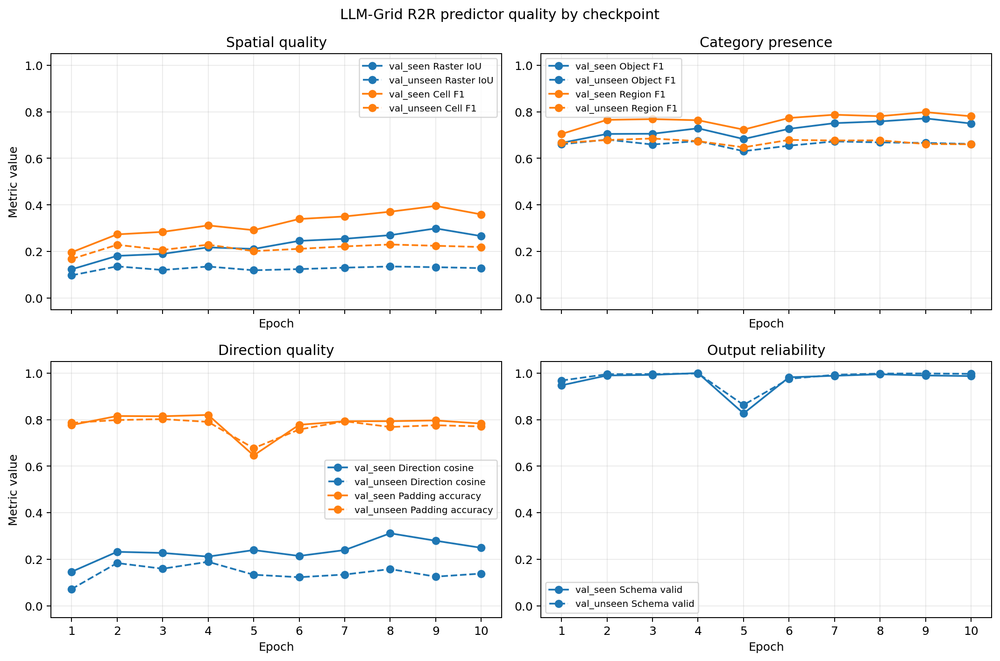

# 2026-07-22：LLM-Grid Checkpoint 泛化曲线

> 本记录细化 [2026-07-21 的 checkpoint 泛化曲线与可辨识部分分析](2026-07-21.md#3-绘制-checkpoint-泛化曲线)；子任务状态和结果以本页为准。

## 目标

在同一套完整 R2R `val_seen`/`val_unseen` episode 上比较现有 LLM-Grid epoch 1–10，回答 seen/unseen 差距从何时开始扩大，并为 checkpoint 选择提供依据。

本次比较只评价已经训练完成的同一条实验线：

- checkpoint root：`outputs/llm_grid/r2r-rxr-legacy-r1p5-direction5-s2-no-dataset-tag/checkpoints/epoch-<N>`；
- epoch 10 与 `final` 的 adapter 权重和配置相同，可复用 cache key `llm-grid-r2r-rxr-r1p5-direction5-s2-tagfree`；
- epoch 1–9 需要各自生成完整的 R2R validation raw-prediction cache；
- 现有 `llm-grid-r2r-rxr-epoch-5`/`epoch-10` 是抽样 cache，不能用于完整 split 的公平比较。

## 前置问题判断

- GT namespace 名称差异已经确认不会改变有效 scale-2 target，不阻塞比较；
- 不应在本轮比较前修正 prompt 的 row/column 与 direction-vector contract。旧 checkpoint 都在原 contract 下训练，先测量它们才能得到可解释的 epoch 曲线；prompt 修正应作为下一条重新训练的实验线；
- 完整 split 比较不使用 `--limit`，所以并行 worker 的 limit 语义不阻塞本轮；
- 当前 cache generator 总是生成 pretrain、train 和 validation，直接用于十个 checkpoint 会浪费大量推理，应先增加只生成 R2R `val_seen`/`val_unseen` 的显式 scope；
- epoch 结论必须基于相同 episode denominator。partial cache 只能用于调试，不能混入正式曲线。

## 实现清单

- [x] 为 LLM-Grid evaluator 增加 object-category precision/recall/F1；
- [x] 为 LLM-Grid evaluator 增加 region-category precision/recall/F1；
- [x] invalid/missing prediction 按空预测计零，并保留在完整 episode denominator；
- [x] category precision/recall/F1 使用 split 级 pooled/micro 统计，并输出 TP、预测数和 target 数；
- [x] 为 cache generator 增加显式 `predictor-eval` scope，只生成 R2R `val_seen`/`val_unseen`；
- [x] predictor-eval 以 raw prediction 为断点续跑完成条件；parse-invalid prediction 保留但不终止 sweep；
- [x] 将 scope 传递给并行 worker，并只聚合所选 split；
- [x] 增加多 cache sweep 工具，使用显式有序 run manifest，拒绝重复 label/cache key；
- [x] 正式 sweep 拒绝 raw prediction coverage 不完整或 denominator 不一致的 cache；
- [x] 输出每个 run 的 `metrics.json` 以及汇总 JSON/CSV；
- [x] 为新 metric、scope 和 sweep contract 增加测试；
- [x] 运行 `ruff`、`ty` 和相关测试：111 tests passed；

## 实验清单

- [x] 生成 epoch 1–9 的完整 predictor-eval cache；
- [x] 复用完整 epoch 10 cache，并用新增 metric 完成 baseline 评价；
- [x] 运行 epoch 1–10 sweep；
- [x] 按 epoch 记录 `val_seen`/`val_unseen` 的 category-aware raster IoU、cell precision/recall/F1、object-category precision/recall/F1、region-category precision/recall/F1、direction cosine/L2/padding accuracy、schema-valid rate；
- [x] 检查每个 split 的 raw prediction coverage 和 denominator；
- [x] 根据 `val_unseen` 指标选择候选 checkpoint，而不是根据 train loss、格式合法率或少量可视化样本；
- [x] 将完整结果表和结论补充到本记录，并在 `docs/NOTE.md` 保留摘要链接。

## Episode 级误差分析

- [x] 在 predictor-quality evaluation 的同一次遍历中导出自描述的 `episodes.csv`，不重复加载 cache；
- [x] 记录 instruction 字符/词数、prediction 字符数、target category-cell/spatial density、类别数、方向数和所有既有质量指标；
- [x] 输出每个 split 的分位数、schema-valid population Pearson 相关性，以及 best/median/worst/最大类别-空间差距的代表 episode；
- [x] 重跑 epoch 10 evaluator，记录 `val_seen`/`val_unseen` 分布、相关性和代表 episode；
- [ ] 根据固定代表 episode 补充可视化核查；
- [x] 判断 instruction/target 复杂度是否解释主要误差，还是 scene novelty 仍占主导。

产物位于 `outputs/llm_grid_eval/r1p5/episodes.csv` 和 `diagnostics.json`。相关性只使用 schema-valid prediction；分布仍以完整 split 为分母。

主要结果：

- instruction 长度不是主要解释变量：word count 与 raster IoU 的 Pearson correlation 在 `val_seen`/`val_unseen` 分别仅为 `+0.043`/`-0.028`；最长与最短四分位的 unseen mean IoU 只相差 `-0.004`；
- target 空间密度会增加难度，但不足以解释 seen/unseen gap：spatial density 与 IoU 的 correlation 在 `val_seen`/`val_unseen` 为 `-0.135`/`-0.280`；unseen 最密与最稀四分位 mean IoU 相差 `-0.053`；
- 类别正确不保证 unseen 布局正确：object/region category F1 与 IoU 的 correlation 在 seen 为 `0.591`/`0.502`，到 unseen 降为 `0.033`/`0.154`。`Z6MFQCViBuw/R2R_val_unseen_669` 的 combined category F1 为 `0.870`，但 cell F1 和 IoU 均为 `0`；
- scene novelty 仍是更强的解释：seen IoU P50/P90 为 `0.149`/`0.729`，unseen 为 `0.121`/`0.234`；768 个 schema-valid seen episode 中 27 个 IoU ≥ 0.9，而 1833 个 schema-valid unseen episode 中没有一个 IoU ≥ 0.5；
- 固定代表 episode：unseen best 为 `zsNo4HB9uLZ/R2R_val_unseen_745`（IoU `0.408`，cell F1 `0.579`），median 为 `QUCTc6BB5sX/R2R_val_unseen_433`（IoU `0.122`），类别正确但布局错误代表为上述 `R2R_val_unseen_669`。

结论：target 密度是可测量的次要难度因素，instruction 长度基本不是；类别到空间的联系在 unseen scene 中明显断裂。现有证据更支持 scene memorization 与输入不可辨识性共同主导泛化差距，而不是“指令太长”或单纯格式失败。

## Epoch 1–10 完整结果

每个 epoch 均覆盖完全相同的 778 个 `val_seen` 和 1839 个 `val_unseen` episode，raw prediction 缺失数均为 0。格式无效的输出仍按空预测保留在固定分母中。完整精度、召回率、L2、support 和计数见 `outputs/llm_grid_eval/checkpoint-sweep-r1p5/metrics.csv`；下表保留 checkpoint 判断所需的核心指标。

### `val_seen`

| Epoch | Raster IoU | Cell F1 | Object F1 | Region F1 | Direction cosine | Padding acc. | Schema valid |
|---:|---:|---:|---:|---:|---:|---:|---:|
| 1 | 0.123 | 0.196 | 0.666 | 0.705 | 0.146 | 0.777 | 94.7% |
| 2 | 0.181 | 0.273 | 0.705 | 0.765 | 0.232 | 0.815 | 99.0% |
| 3 | 0.189 | 0.284 | 0.706 | 0.769 | 0.227 | 0.814 | 99.2% |
| 4 | 0.217 | 0.312 | 0.729 | 0.764 | 0.211 | 0.820 | 100.0% |
| 5 | 0.211 | 0.291 | 0.683 | 0.723 | 0.239 | 0.646 | 82.6% |
| 6 | 0.245 | 0.339 | 0.727 | 0.774 | 0.214 | 0.778 | 98.2% |
| 7 | 0.254 | 0.350 | 0.751 | 0.787 | 0.239 | 0.793 | 98.8% |
| 8 | 0.270 | 0.371 | 0.759 | 0.781 | 0.311 | 0.793 | 99.5% |
| 9 | 0.299 | 0.395 | 0.772 | 0.799 | 0.279 | 0.796 | 99.0% |
| 10 | 0.266 | 0.359 | 0.750 | 0.781 | 0.249 | 0.783 | 98.7% |

### `val_unseen`

| Epoch | Raster IoU | Cell F1 | Object F1 | Region F1 | Direction cosine | Padding acc. | Schema valid |
|---:|---:|---:|---:|---:|---:|---:|---:|
| 1 | 0.097 | 0.167 | 0.660 | 0.667 | 0.072 | 0.786 | 96.8% |
| 2 | **0.136** | 0.228 | **0.681** | 0.679 | 0.184 | 0.798 | 99.5% |
| 3 | 0.120 | 0.207 | 0.659 | **0.685** | 0.159 | **0.802** | 99.6% |
| 4 | 0.135 | 0.229 | 0.675 | 0.674 | **0.189** | 0.790 | 99.8% |
| 5 | 0.119 | 0.201 | 0.631 | 0.647 | 0.133 | 0.677 | 86.3% |
| 6 | 0.124 | 0.211 | 0.654 | 0.679 | 0.123 | 0.757 | 97.6% |
| 7 | 0.130 | 0.222 | 0.673 | 0.677 | 0.134 | 0.793 | 99.2% |
| 8 | 0.135 | **0.230** | 0.669 | 0.677 | 0.158 | 0.768 | 99.8% |
| 9 | 0.132 | 0.224 | 0.666 | 0.662 | 0.125 | 0.776 | 99.8% |
| 10 | 0.128 | 0.219 | 0.662 | 0.661 | 0.138 | 0.771 | 99.7% |



### 解释与 checkpoint 选择

- 按预先固定的主指标 `val_unseen` category-aware raster IoU，**epoch 2 是候选 checkpoint**：IoU 为 0.135701，同时 object F1 也最高。epoch 8 的 cell F1 最高，IoU 0.135204，仅比 epoch 2 低 0.000496；epoch 4 的 direction cosine 最高。三者的 IoU 差异很小，在补充 scene-bootstrap 置信区间前不应声称 epoch 2 显著优于 epoch 4/8。
- unseen IoU 从 epoch 1 到 2 由 0.097 上升到 0.136，之后只在 0.119–0.135 间波动；seen IoU 却总体继续上升，并在 epoch 9 达到 0.299。seen–unseen IoU gap 从 epoch 1 的 0.026、epoch 2 的 0.045 扩大到 epoch 9 的 0.167。这比之前 epoch 5/10 的局部观察更清楚地支持：约从 epoch 3 起，继续训练主要增强 seen-scene 拟合，而没有持续改善 unseen 空间泛化。
- unseen 类别 F1 从早期起就稳定在约 0.63–0.69，明显高于 cell F1 和 raster IoU；方向 cosine 同样没有随训练持续改善。因此核心瓶颈不是 JSON 格式或类别存在性，而是把类别与方向落实到 unseen scene 的精确空间布局。
- epoch 5 是独立的输出格式退化点：`val_seen` 135/778、`val_unseen` 252/1839 个 prediction schema-invalid，导致 schema validity、padding accuracy 和其它核心指标同时下降；epoch 6 即恢复。它不改变跨 epoch 的固定分母，也不应被解释为平滑的过拟合趋势。
- epoch 10 不是最佳 checkpoint：其 seen/unseen IoU 都低于 epoch 9，unseen IoU 也低于 epoch 2/4/8。之前根据少量 train 可视化得到的“epoch 10 接近完美”主要反映训练样本记忆，不能作为 checkpoint 选择依据。

## 运行方式

epoch 1–9 validation cache 已通过八张 GPU 生成并复制回本地。正式 sweep 在本地环境运行：

```shell
python -m vlnce_baselines.models.etp_llm.llm_grid_eval_sweep \
  --run-manifest scripts/submit/llm-grid-eval-sweep-r1p5.json \
  --output-dir outputs/llm_grid_eval/checkpoint-sweep-r1p5

python -m vlnce_baselines.models.etp_llm.llm_grid_eval_plot \
  --input-path outputs/llm_grid_eval/checkpoint-sweep-r1p5/metrics.json \
  --output-path docs/images/llm_grid_checkpoint_sweep_r1p5.png
```

聚合结果位于 `outputs/llm_grid_eval/checkpoint-sweep-r1p5/metrics.json` 和 `metrics.csv`；每个 epoch 的 episode 级指标与诊断位于 `runs/000`–`runs/009`。

## 指标解释

- cell 和 raster 指标在 category×row×column tensor 上计算，错误类别不会产生交集；
- object/region category 指标只评价对应 channel 是否存在非零 cell，衡量类别层面的预测，不评价位置；
- category 指标把完整 split 的类别 TP、预测数和 target 数汇总后计算 pooled/micro precision、recall、F1；invalid/missing prediction 作为空预测保留在 denominator；
- 几乎满分的 schema validity 只能说明输出格式稳定，不能说明 unseen scene 的类别、位置或方向预测准确。

## 后续实验线

完成旧 checkpoint 曲线后，再修正 prompt contract 并进行短训练。新实验必须使用新的 checkpoint/cache key，不能与本轮旧 contract 的 epoch 曲线合并解释。
