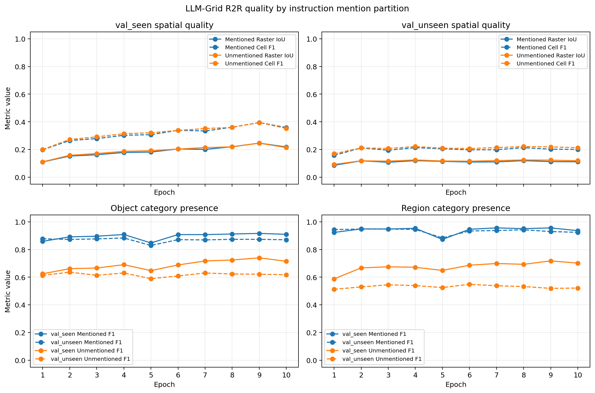

# 2026-07-23：LLM-Grid mentioned/unmentioned 空间与类别分析

> 本记录延续 [2026-07-22 的 epoch 1–10 predictor-quality sweep](2026-07-22.md#epoch-110-完整结果)，使用同一批完整 R2R validation cache，不重新运行 LLM 推理。

## 问题

LLM-Grid 的目标不仅包含 instruction 提及的类别，也包含路径附近但未提及的语义上下文。这里分别检验：unmentioned category 是否比 mentioned category 更难恢复、两组 category 的网格位置质量是否也存在同方向差距，以及这些现象是否贯穿 epoch 1–10。

## 评价协议

- dataset：R2R `val_seen`/`val_unseen`；每个 epoch 分别固定为 778/1839 个 episode，raw prediction 缺失数均为 0；
- checkpoint/cache：沿用 `llm-grid-r2r-rxr-r1p5-direction5-s2-tagfree-epoch-1` 至 `epoch-9`，epoch 10 沿用无 epoch 后缀的 final cache；
- mention status：使用项目现有的 `extract_categories(instruction)`，按规范化短语、名词 lemma 和既有 CLIP category matcher 把**完整 object/region 词表**划分为 mentioned 与 unmentioned；不采用模型生成 JSON 中自报的 `mentioned` flag；
- category 指标：分别在 mentioned/unmentioned object/region 词表子空间统计 category presence 的 pooled/micro precision、recall、F1、TP、prediction count 和 target count；一个 category channel 至少有一个非零 cell 才视为 present；
- spatial 指标：用同一组互补 channel mask 同时遮罩 prediction 与 target，把 object/region 合并后分别统计 mentioned/unmentioned 的 split-pooled cell precision/recall/F1 与 category-aware raster IoU，并输出 intersection、union、prediction/target cell count 和含 target 的 episode 数；
- invalid/missing：schema-invalid prediction 仍按空预测保留在固定分母中；本次没有 missing prediction；
- 产物：`outputs/llm_grid_eval/checkpoint-sweep-r1p5/metrics.json`、`metrics.csv`、`runs/000`–`runs/009` 和 `docs/images/llm_grid_mentioned_spatial_category_sweep_r1p5.png`。

这里的 mentioned 是项目的 operational label，不等同于人工标注的显式文本 grounding：matcher 会使用 lemma/fuzzy mapping，忽略否定，并可能把歧义词同时映射到 object 与 region。unmentioned 也不等于“完全无法从 route context 推断”。

## 实现与运行清单

- [x] 固定 instruction-derived mention partition，避免把模型自报 flag 准确率混入 category recoverability；
- [x] 保留既有 overall category metrics，并新增 mentioned/unmentioned object/region pooled P/R/F1 与计数；
- [x] invalid prediction 保留各组 target support，prediction/TP 计零；
- [x] 验证 overall category prediction/target count 等于 mentioned 与 unmentioned 分组之和；
- [x] 用相同的完整词表 channel partition 增加 mentioned/unmentioned pooled spatial P/R/F1、IoU、cell count 与 target-episode support；
- [x] 保留原有 overall episode-macro spatial 指标，并显式记录它与新增 split-pooled 指标的 aggregation 不同；
- [x] 区分 empty/empty stratum、prediction-only stratum 与 invalid prediction with target support；
- [x] 验证 spatial prediction/target cell count 的 partition conservation 和跨 epoch target support 不变；
- [x] 重跑 epoch 1–10 完整 sweep；
- [x] 记录 support、完整 F1 曲线和候选 epoch 2 的 P/R/F1；
- [x] 生成并目视检查单独的 mentioned/unmentioned 2×2 空间与类别曲线；
- [x] 更新 `CONTEXT.md`、`docs/NOTE.md` 和前一日后续项；
- [x] 运行 `ruff`、变更相关 `ty` 检查与 `tests/etp_llm`：246 passed、2 skipped。
- [x] 修正 LLM-Grid prompt 的网格轴定义：`[row,col]=[world x,world z]`；
- [x] 修正共享输入与 LLM-Grid/Boxes prompt 的方向定义：display frame `[right,up]=[-dz,-dx]`；
- [x] 增加 prompt、共享输入和独立实验 launcher 的 contract tests；修正后 `tests/etp_llm` 为 247 passed、2 skipped，`ruff`、`ty` 与 `bash -n` 均通过；
- [x] 完成 matched 2-epoch prompt-contract control，并与旧 prompt epoch 2 做 paired scene-cluster bootstrap；
- [x] 对旧 prompt epoch 2 cache 完成同路径 paraphrase consistency 与 matched/global/within-scene cache permutation；
- [x] 实现 paired scene-cluster bootstrap，先比较旧 prompt epoch 2/4/8，并可直接复用于 contract-v2。

## Prompt contract 修正与 matched control

旧 prompt 同时把两个坐标约定写反：target raster 实际以 world x 为 row、world z 为 column，方向数组实际保存 display frame `[right,up]=[-dz,-dx]`，但 prompt 分别宣称 column=x、row=z 和 `[dx,dz]`。训练 target、parser、cache 与 evaluator 一直按相同数组顺序传递，因此这不是 evaluator 把正确结果算错，而是模型面对的自然语言监督与 target 数值含义矛盾；它会妨碍预训练空间概念迁移，并可能增加 unseen 泛化难度。

修正提交为 `a0bb323`。对照只改变 prompt contract 和共享输入字段名，保持 base model、R2R+RxR corpus、GT namespace、sampler seed 42、LoRA、长度限制、batch、decode 与评价协议不变，并固定训练 2 epochs：

- train launcher：`scripts/submit/llm-grid-train-r1p5-contract-v2-e2.sh`；
- run：`outputs/llm_grid/r2r-rxr-legacy-r1p5-direction5-s2-no-dataset-tag-contract-v2-e2`；
- checkpoint：`checkpoints/epoch-2`；
- cache key：`llm-grid-r2r-rxr-r1p5-direction5-s2-tagfree-contract-v2-epoch-2`；
- eval launcher：`scripts/submit/llm-grid-eval-r1p5-contract-v2-e2.sh`；
- eval：`outputs/llm_grid_eval/contract-v2-epoch-2-r1p5`；
- control：旧 prompt epoch 2，`outputs/llm_grid_eval/checkpoint-sweep-r1p5/runs/001`。

本地启动后在 manifest 序列化阶段按用户要求取消；8 个 worker 已退出，GPU 已释放。未完成产物保留为 `...contract-v2-e2-failed-local-20260723T0413Z`。正式 Slurm train job `1181145` 与依赖的 cache/eval job `1181199` 均以 `COMPLETED 0:0` 结束；train 完成 2 epochs/7606 optimizer steps，cache 覆盖完整 778/1839 个 `val_seen`/`val_unseen` episode。

system prompt SHA-256 为 `3c7173b7…de2`，与本地修正后 contract 一致；epoch 2 与 final adapter SHA-256 均为 `a867b9d9…83e`。已把 epoch-2 checkpoint、training manifest/prompt/metrics、完整 navigation cache、predictor evaluation 和两份 Slurm log 复制回本机；未传输与 epoch 2 重复的 final checkpoint 和本次不用的 epoch 1 checkpoint。传输 archive 校验成功后，本地临时文件及 login node 上两份临时 `.tar.gz` 均已删除。

### Matched result

比较旧 prompt epoch 2 与 contract-v2 epoch 2；delta 为 contract-v2−旧 prompt。两份 CSV 的 2617 个 key、scene、instruction、target density/cell/direction support 和 object/region target count 逐 episode 完全一致；按 scene cluster bootstrap 10,000 次，seed 42：

| Split | Metric | Old | Contract-v2 | Delta [95% CI] |
|---|---|---:|---:|---:|
| `val_seen` | Raster IoU | 0.1809 | 0.1857 | +0.0049 [-0.0116, 0.0209] |
| `val_seen` | Cell F1 | 0.2733 | 0.2829 | +0.0096 [-0.0110, 0.0297] |
| `val_seen` | Object F1 | 0.7049 | 0.7134 | +0.0085 [-0.0043, 0.0215] |
| `val_seen` | Region F1 | 0.7654 | 0.7685 | +0.0031 [-0.0079, 0.0142] |
| `val_seen` | Direction cosine | 0.2318 | 0.1958 | -0.0360 [-0.0915, 0.0190] |
| `val_seen` | Schema valid | 0.9897 | 0.9949 | +0.0051 [-0.0014, 0.0122] |
| `val_unseen` | Raster IoU | 0.1357 | 0.1340 | -0.0017 [-0.0080, 0.0051] |
| `val_unseen` | Cell F1 | 0.2285 | 0.2262 | -0.0022 [-0.0121, 0.0083] |
| `val_unseen` | Object F1 | 0.6807 | 0.6706 | -0.0101 [-0.0197, -0.0008] |
| `val_unseen` | Region F1 | 0.6787 | 0.6629 | -0.0158 [-0.0230, -0.0092] |
| `val_unseen` | Direction cosine | 0.1835 | 0.1126 | -0.0709 [-0.1088, -0.0403] |
| `val_unseen` | Schema valid | 0.9951 | 0.9924 | -0.0027 [-0.0095, 0.0033] |

contract-v2 没有改善 unseen spatial quality；Raster IoU 与 Cell F1 的 CI 均跨零。seen spatial 点估计略升但同样不能与零区分，seen−unseen Raster IoU gap 反而从 0.0452 扩大到 0.0517。这个 contract-v2 checkpoint 的 unseen object/region F1 和 direction cosine 明确低于旧 checkpoint；schema validity 的变化在两个 split 都不能与零区分。

因此错误 prompt 是真实的 contract defect，修正仍应保留，但本次 matched control 不支持“它是低 IoU 的主要原因”。进一步核查发现训练参数 `--seed 42` 只传给 length-grouped sampler，并未在 LoRA 初始化前统一设置 Python、NumPy、Torch/CUDA 与 dropout RNG；scene-cluster bootstrap 只覆盖给定两个 checkpoint 的 validation-scene 不确定性，不覆盖训练随机性。可以可靠地说“本次修正后 run 未改善 spatial quality，且部分指标更低”，不能由单次 run 推断“正确 contract 导致性能下降”。

contract-v2 的 cache permutation 也保留了几乎相同的 spatial input-dependence：`val_unseen` matched/within-scene/global Raster IoU 为 0.1340/0.0572/0.0340，旧 prompt 为 0.1357/0.0608/0.0356；matched−global 分别为 0.1001/0.1001。空间上的 episode-specific signal 没有因 contract 修正而增强。其同路径 paraphrase Raster IoU 从 0.2840 略升至 0.2920，但 category Jaccard 0.6644→0.6625 基本不变，direction cosine 0.3539→0.2541、padding accuracy 0.8504→0.8364 下降；invalid pair 从 18 增至 26。该结果与 official direction metric 的下降一致。

## Input-dependence controls

本轮使用旧 prompt 的 epoch 2 cache：
`llm-grid-r2r-rxr-r1p5-direction5-s2-tagfree-epoch-2`。分析产物位于
`outputs/llm_grid_eval/input-dependence-r1p5-epoch-2/`。

### 同路径 paraphrase consistency

raw R2R 中相同 `trajectory_id` 的多条指令共享 scene、起点、路径和目标，因此在本项目的 binary occupancy 与 direction target contract 下可作同路径 paraphrase。`val_seen` 共 259 条 trajectory、780 对指令，`val_unseen` 共 613 条 trajectory、1839 对指令；schema-invalid pair 单独计数并从 agreement 均值排除。

| Split | Valid/All pairs | Category Jaccard | Raster IoU | Direction cosine | Padding accuracy |
|---|---:|---:|---:|---:|---:|
| `val_seen` | 764/780 | 0.701 | 0.308 | 0.367 | 0.849 |
| `val_unseen` | 1821/1839 | 0.664 | 0.284 | 0.354 | 0.850 |

生成使用 greedy decoding，因此同一路径下的差异来自 instruction sensitivity，而不是采样噪声。类别集合较稳定，但精确 cell 与方向的一致性明显较低；这说明模型会响应措辞和指令细节，却没有从等价 route descriptions 恢复稳定的唯一 full-grid layout。

### Cache permutation

把每个 episode 的 raw prediction 重新配给另一个 target，再按 binary category-aware occupancy 重新评分。global 与 within-scene 分别使用 seed 42 的 deterministic Sattolo cycle，保证没有 episode fixed point。该实验是**已生成 cache 的 prediction-target reassignment**，不是重新运行模型时真正 shuffle 输入，不能声称测得了模型对 shuffled instruction 的因果敏感性。

| Split | Assignment | Raster IoU | Cell F1 | Object F1 | Region F1 | Direction cosine |
|---|---|---:|---:|---:|---:|---:|
| `val_seen` | matched | 0.181 | 0.273 | 0.705 | 0.765 | 0.229 |
| `val_seen` | within-scene | 0.082 | 0.133 | 0.661 | 0.648 | 0.066 |
| `val_seen` | global | 0.024 | 0.042 | 0.607 | 0.525 | 0.003 |
| `val_unseen` | matched | 0.136 | 0.228 | 0.681 | 0.679 | 0.183 |
| `val_unseen` | within-scene | 0.061 | 0.106 | 0.644 | 0.568 | -0.002 |
| `val_unseen` | global | 0.036 | 0.063 | 0.633 | 0.562 | -0.003 |

matched 明显高于 global，说明输出不是纯 global prior；matched 也高于 within-scene，说明存在 episode/instruction-specific signal。另一方面，within-scene 和 global 的 category F1 仍很高，表明 category prevalence 与 scene inventory prior 占了相当部分；空间和方向在 reassignment 后大幅下降，才是更清楚的 episode correspondence 证据。

within-scene permutation 会把同一 `trajectory_id` 的 paraphrase 互换：`val_seen` 为 16.2%，`val_unseen` 为 1.0%。因此 seen 的 within-scene control 偏容易，不能把它当作严格的不同路径 baseline；结果已显式报告该污染率。

### 解释边界

以上两项联合支持一个较窄但更可靠的表述：instruction 确实提供 category、粗略 route geometry 和 direction 的 episode-specific signal；但它不足以唯一确定 unseen scene 的完整 absolute metric layout。结果不支持“predictor 完全没有学习输入”，也不支持“只要换一个更好的 predictor 就能恢复未观测 full grid”。后续 matched control 已进一步排除错误 prompt 作为低 IoU 的主要解释。

### Paired scene-cluster bootstrap

以 episode 配对、scene 为 cluster，seed 42 重采样 10,000 次；`val_seen`/`val_unseen` 分别有 53/11 个 scene。对旧 prompt epoch 2 与 epoch 4/8 的比较如下，delta 均为 candidate−epoch 2：

| Split | Candidate | Raster IoU delta [95% CI] | Cell F1 delta [95% CI] | Direction delta [95% CI] |
|---|---|---:|---:|---:|
| `val_seen` | epoch 4 | +0.0365 [0.0131, 0.0614] | +0.0384 [0.0125, 0.0652] | -0.0205 [-0.0742, 0.0324] |
| `val_seen` | epoch 8 | +0.0890 [0.0627, 0.1189] | +0.0974 [0.0686, 0.1301] | +0.0796 [0.0194, 0.1420] |
| `val_unseen` | epoch 4 | -0.0007 [-0.0112, 0.0107] | +0.0004 [-0.0149, 0.0175] | +0.0054 [-0.0472, 0.0547] |
| `val_unseen` | epoch 8 | -0.0005 [-0.0136, 0.0111] | +0.0013 [-0.0184, 0.0184] | -0.0260 [-0.0658, 0.0079] |

因此 epoch 4/8 的 seen spatial 改善清楚，但没有证据表明其 unseen IoU 或 cell F1 优于 epoch 2；这加强了“继续训练主要改善 seen scene”的结论，也说明 11 个 unseen scene 下不能解释小数点后三位的 checkpoint 差异。

本次 contract-v2 comparison 的复现命令为：

```shell
python -m vlnce_baselines.models.etp_llm.llm_grid_paired_bootstrap \
  --baseline-episodes outputs/llm_grid_eval/checkpoint-sweep-r1p5/runs/001/episodes.csv \
  --candidate-episodes outputs/llm_grid_eval/contract-v2-epoch-2-r1p5/episodes.csv \
  --output-dir outputs/llm_grid_eval/bootstrap-epoch2-vs-contract-v2-epoch2-r1p5
```

## 增加输入但保持导航接口不变

partial observed grid 不必一开始就重写 navigation pipeline。当前 rollout 已有起点处的 12-view RGB/depth panorama，而导航侧消费的是固定的 cognitive-map cache；可以只改**预测 cache 的生成阶段**，保持输出 `.npz` schema、Try5 map encoder 和导航训练/评价接口不变：

1. 从 `t=0` panorama 构造 start-centered、heading-normalized 的 sparse observed map，并同时保存 `observed/unknown` mask；
2. 用冻结的 perception/projection 模块把观测压成文本可序列化的 evidence，附加到 LLM predictor 输入；
3. predictor 仍输出现有 full-grid/cache schema，使用新的 cache namespace；先只做 predictor-quality matched ablation；
4. 只有 predictor 指标通过预设标准后，才重新生成 navigation cache 并训练相同 Try5，对 no-map/zero/shuffled/matched 做固定预算比较。

建议按信息量逐级增加，而不是直接上完整 semantic grid：

- instruction-only；
- `+` depth/free-space 与可见范围 mask；
- `+` 可见 semantic inventory，不给坐标；
- `+` sparse spatial semantic cells。

这样可以区分几何可见性、类别证据和精确位置各自的增益。第一轮最好使用冻结 extractor，避免同时改变 perception 与 predictor 两个变量。若 sparse observed cells 已明显改善 unseen spatial metric，便是 input insufficiency 的直接干预证据。

必须执行的防泄漏约束：只使用预测时刻及之前可见的传感器数据；禁止读取 GT trajectory、goal、完整 semantic boxes、teacher prefix 或 sibling paraphrase；cache manifest 记录 observation time、pose、sensor、extractor、坐标变换和 prompt version。当前 cache item 的 local start coordinate 由 GT trajectory 路径间接取得，虽然数值通常等于 agent 可用起点，正式声称 leakage-safe 前应改为显式 start-only coordinate adapter。

如果只增加 `t=0` observation 仍无法改善，则不应立即在线更新全 pipeline。先把 target 改成输入真正支持的对象：mentioned category、coarse relative route envelope、方向或多个合理 hypothesis。只有需要随导航持续融合新观测时，才引入 online deterministic merge；这会改变静态 prior 的语义与 ADR 0007 的 cache policy，应另写 ADR 并重新训练 policy。

## Target support

support 对所有 epoch 固定；unmentioned target 数量更多，因此后续性能差距不能归因于 unmentioned 样本太少，但仍可能受两个 partition 的 category composition 与 prevalence 差异影响。

| Split | Mentioned object | Unmentioned object | Mentioned region | Unmentioned region |
|---|---:|---:|---:|---:|
| `val_seen` | 1,448 | 6,448 | 947 | 1,880 |
| `val_unseen` | 3,549 | 16,101 | 2,266 | 4,214 |

## Epoch 1–10 pooled category F1

M/U 分别表示 mentioned/unmentioned。

| Epoch | Seen obj M | Seen obj U | Seen reg M | Seen reg U | Unseen obj M | Unseen obj U | Unseen reg M | Unseen reg U |
|---:|---:|---:|---:|---:|---:|---:|---:|---:|
| 1 | 0.859 | 0.624 | 0.923 | 0.587 | 0.877 | 0.613 | 0.944 | 0.512 |
| 2 | 0.891 | 0.661 | 0.949 | 0.667 | 0.873 | 0.636 | 0.948 | 0.529 |
| 3 | 0.896 | 0.666 | 0.948 | 0.675 | 0.876 | 0.613 | 0.948 | 0.545 |
| 4 | 0.908 | 0.690 | 0.953 | 0.671 | 0.883 | 0.630 | 0.945 | 0.539 |
| 5 | 0.847 | 0.647 | 0.873 | 0.649 | 0.829 | 0.589 | 0.884 | 0.525 |
| 6 | 0.908 | 0.688 | 0.946 | 0.686 | 0.871 | 0.608 | 0.934 | 0.548 |
| 7 | 0.908 | 0.717 | 0.956 | 0.699 | 0.869 | 0.630 | 0.937 | 0.538 |
| 8 | 0.912 | 0.724 | 0.950 | 0.693 | 0.873 | 0.623 | 0.942 | 0.532 |
| 9 | 0.916 | 0.740 | 0.956 | 0.718 | 0.873 | 0.621 | 0.930 | 0.519 |
| 10 | 0.910 | 0.715 | 0.936 | 0.702 | 0.870 | 0.617 | 0.924 | 0.521 |

## Epoch 2 详细结果

epoch 2 是前一日按 `val_unseen` raster IoU 预先选出的主候选。在当前固定 decode 下，unmentioned precision 与 recall 同时更低，表示 false positive 和 false negative 两侧都更差；本实验没有做 threshold/calibration sweep。

| Split | Group | Precision | Recall | F1 |
|---|---|---:|---:|---:|
| `val_seen` | mentioned object | 0.895 | 0.887 | 0.891 |
| `val_seen` | unmentioned object | 0.693 | 0.632 | 0.661 |
| `val_seen` | mentioned region | 0.939 | 0.959 | 0.949 |
| `val_seen` | unmentioned region | 0.705 | 0.633 | 0.667 |
| `val_unseen` | mentioned object | 0.896 | 0.851 | 0.873 |
| `val_unseen` | unmentioned object | 0.694 | 0.587 | 0.636 |
| `val_unseen` | mentioned region | 0.942 | 0.953 | 0.948 |
| `val_unseen` | unmentioned region | 0.544 | 0.516 | 0.529 |

## Mentioned/unmentioned 空间质量

### Aggregation 与空 stratum contract

原有 overall `category_aware_raster_iou` 和 `cell_f1` 保持不变：先按 episode 计算，再对完整 split 做不加权 macro average。新增 mentioned/unmentioned spatial 指标则按本次明确选择的 contract，先在完整 split 内汇总 intersection、union、prediction cell 和 target cell，再由总数计算 pooled/micro P/R/F1 与 IoU。因此两类数值的 aggregation 不同，**不能把 pooled partition 值与原有 macro overall 值当作同口径直接相减或做加权还原**。

空 stratum 的处理由 pooled count 明确定义：

- target/prediction 都为空时不增加 intersection、union 或 cell count，不凭空记一个零分；
- target 为空但 prediction 非空时增加 prediction 和 union，作为 false positive 被惩罚；
- schema-invalid/missing prediction 仍按空 prediction 处理；只要 target 有 cell，就增加 target 和 union，作为 false negative 被惩罚；
- 所有 episode 始终保留在 `examples` denominator；另报 `spatial_target_episode_count`，区分“该 stratum 没有 target”与“有 target 但 prediction 无效”。

### 固定 target support

target support 在十个 epoch 完全相同。cell 数是 pooled spatial metric 的实际权重；episode 数表示该 partition 至少有一个 target cell 的 episode 数，两个 partition 可在同一 episode 同时出现，因此 episode support 不要求相加等于 split denominator。

| Split | Mentioned target cells | Mentioned target episodes | Unmentioned target cells | Unmentioned target episodes | Examples |
|---|---:|---:|---:|---:|---:|
| `val_seen` | 45,615 | 742 | 111,862 | 752 | 778 |
| `val_unseen` | 99,775 | 1,811 | 245,894 | 1,839 | 1,839 |

### Epoch 1–10 pooled spatial 曲线

M/U 分别表示 mentioned/unmentioned；IoU 为 category-aware raster IoU。

| Epoch | Seen M IoU | Seen U IoU | Seen M F1 | Seen U F1 | Unseen M IoU | Unseen U IoU | Unseen M F1 | Unseen U F1 |
|---:|---:|---:|---:|---:|---:|---:|---:|---:|
| 1 | 0.1096 | 0.1106 | 0.1975 | 0.1991 | 0.0854 | 0.0923 | 0.1574 | 0.1690 |
| 2 | 0.1526 | 0.1578 | 0.2647 | 0.2726 | 0.1181 | 0.1182 | 0.2112 | 0.2115 |
| 3 | 0.1619 | 0.1705 | 0.2787 | 0.2913 | 0.1079 | 0.1156 | 0.1947 | 0.2072 |
| 4 | 0.1783 | 0.1864 | 0.3027 | 0.3142 | 0.1194 | 0.1243 | 0.2133 | 0.2211 |
| 5 | 0.1814 | 0.1910 | 0.3070 | 0.3207 | 0.1143 | 0.1170 | 0.2051 | 0.2095 |
| 6 | 0.2038 | 0.2033 | 0.3386 | 0.3379 | 0.1095 | 0.1153 | 0.1974 | 0.2067 |
| 7 | 0.2005 | 0.2133 | 0.3340 | 0.3515 | 0.1102 | 0.1196 | 0.1986 | 0.2137 |
| 8 | 0.2199 | 0.2193 | 0.3605 | 0.3597 | 0.1193 | 0.1243 | 0.2132 | 0.2211 |
| 9 | 0.2461 | 0.2457 | 0.3950 | 0.3945 | 0.1125 | 0.1229 | 0.2022 | 0.2188 |
| 10 | 0.2182 | 0.2136 | 0.3583 | 0.3520 | 0.1112 | 0.1189 | 0.2002 | 0.2125 |



候选 epoch 2 的 pooled 详细值如下。`val_unseen` 两组几乎重合：unmentioned−mentioned IoU 仅 `+0.000172`，cell F1 仅 `+0.000274`。

| Split | Group | Cell precision | Cell recall | Cell F1 | Raster IoU |
|---|---|---:|---:|---:|---:|
| `val_seen` | mentioned | 0.242 | 0.292 | 0.265 | 0.153 |
| `val_seen` | unmentioned | 0.247 | 0.305 | 0.273 | 0.158 |
| `val_unseen` | mentioned | 0.194 | 0.231 | 0.211 | 0.118 |
| `val_unseen` | unmentioned | 0.195 | 0.232 | 0.211 | 0.118 |

图可由同一次命令与原 overall 图一起复现：

```shell
python -m vlnce_baselines.models.etp_llm.llm_grid_eval_plot \
  --input-path outputs/llm_grid_eval/checkpoint-sweep-r1p5/metrics.json \
  --output-path docs/images/llm_grid_checkpoint_sweep_r1p5.png \
  --mention-partition-output-path docs/images/llm_grid_mentioned_spatial_category_sweep_r1p5.png
```

## 解释

- **在当前 instruction-derived partition 与 pooled presence 指标下，unmentioned 子空间稳定更低。** 这一方向在 10/10 个 epoch、两个 split、object/region 两类语义上全部成立，而不是某个 checkpoint 的偶然波动。
- `val_unseen` 的 mentioned−unmentioned F1 gap 跨 epoch 始终很大：object 为 0.237–0.264，region 为 0.359–0.432；epoch 2 分别为 0.237 和 0.418。unmentioned region 是最难的组。
- mentioned region F1 在 unseen scene 仍约为 0.92–0.95，说明 instruction 明示或被 matcher 直接关联到的高层区域类别可以跨 scene 恢复。与此前整体 raster IoU 只有约 0.13 联合看，模型主要能预测“应出现什么”，不能可靠预测“在 unseen house 的哪里”。
- unmentioned object/region 更依赖 scene inventory、路径附近上下文或数据先验，而输入没有 scene observation。其明显较低的 recall 与“full-grid target 要求恢复输入中缺失的信息”这一假设一致，但 category composition/base rate 仍是混淆因素；F1 明显高于零则与频率先验或 route-context inference 提供部分信号相容，本实验尚不能区分两者。
- seen split 的 unmentioned F1 随训练总体上升，而 unseen 没有对应持续提升，再次符合 scene memorization：更多 epoch 帮助模型恢复见过房屋的未提及上下文，却没有把这类能力迁移到新房屋。
- epoch 5 在所有 mentioned/unmentioned category-presence 指标上同步下降，与前一日确认的 schema 格式退化一致，并至少部分受 invalid prediction 计零影响；pooled spatial 在 unseen 也下降、seen 却小幅上升，说明 aggregation 与样本密度会改变表观幅度。没有 schema-valid-only 对照，不能把变化全部归因于格式。
- **空间指标没有复现 category presence 的大幅 mentioned 优势。** seen 的 unmentioned pooled IoU/F1 仅在 6/10 个 epoch 略高，差值范围分别为 `-0.0047`–`+0.0128`/`-0.0063`–`+0.0176`；unseen 虽在 10/10 个 epoch 略高，但差值也只有 `+0.0002`–`+0.0104`/`+0.0003`–`+0.0167`。这说明“unmentioned category 更难恢复”不能直接外推成“已恢复的 unmentioned cells 空间得分也必然更低”。
- 该近似持平或轻微反向差距不证明 unmentioned layout 更好。pooled spatial metric 会按 cell/union 加权，而两组的 category composition、目标 cell 数、空间面积与正例 prevalence 明显不同；unmentioned target cells 约为 mentioned 的 2.45 倍。需要 per-category 或 composition/density-standardized 分析才能解释差值来源。
- 两组仍共同呈现原 overall 曲线的主要泛化现象：seen spatial quality 随训练总体上升并在 epoch 9 最高，unseen 则从早期起在低位波动，没有持续改善。mention partition 没有消除 seen/unseen spatial generalization gap。

## 限制与下一步

- category-presence 与 pooled spatial 是不同问题：前者不评价位置，后者又受 cell density/composition 加权；二者都不能单独证明某一 partition 的场景布局已被可靠恢复。
- 两个 partition 的 category composition、positive prevalence 和词表大小不同；当前 pooled gap 不能单独证明差距由 scene context 缺失导致。若要做因果归因，需要补充 per-category 或 composition-standardized 对照。
- R2R episode 在 scene 和路径内相关，且 `val_unseen` 只有 11 个 scene。若要比较 epoch 2/4/8 的细小差异，应做 paired scene-cluster bootstrap；本页只把跨所有 epoch 都同方向的大幅 category M/U gap 视为稳健描述，不对细小 spatial gap 声称显著性。
- 单次训练和固定 cached decode 不能覆盖训练 seed 或生成随机性。
- 本结果为 mentioned-only target ablation 提供动机，但不能证明删掉 unmentioned target 后，下游 LLM-Navigation 一定提升。下一步应在修正 prompt contract 后，对 full target 与 mentioned-only target 做短训，并用相同 predictor-quality 与下游导航协议比较。

## 今日结论

主要瓶颈是 input/target 的信息不匹配：当前输入不含场景观测，却要求 predictor 恢复 unseen house 的精确 full-grid 几何与未提及内容。scene-specific overfit 会放大 seen/unseen gap，但更像是在不可辨识 target 上拟合训练场景。错误 prompt 是独立 defect；matched 2-epoch control 中修正没有改善 unseen spatial quality，且该 checkpoint 的 direction/category 指标部分下降，但单次、未统一训练 RNG 的 run 不能证明修正本身使性能下降。端到端坐标复核与输出变换诊断均确认旧定义错误，修正应保留。

下一步不应继续扩大模型或延长 full-grid 训练。按相同初始化、数据和短训练预算依次比较 full-grid、mentioned-only absolute grid、mentioned-only start-centered/heading-normalized route corridor，分别隔离 unmentioned content 与 absolute unseen-house geometry。若这些可辨识 target 仍不足，再只改 cache generation，逐级加入起点 free-space、semantic inventory 和 sparse observed cells；只有在 `val_unseen` 上超过 prior、对 relevant-input shuffle 敏感且缩小 seen/unseen gap 的方案，才进入下游导航实验。

<details>
<summary>证据、可预测边界与后续验证</summary>

### 已有证据

- raw prediction coverage 为 100%，epoch 2/10 的 schema validity 接近 100%，但 best `val_unseen` raster IoU 仅 0.136，因此缺失输出或 JSON 格式不是主要瓶颈；
- unseen IoU 在 epoch 2 后停滞，seen IoU 却继续上升并在 epoch 9 达到 0.299，seen–unseen gap 扩大到 0.167，支持 scene-specific overfit；
- 输入只有四舍五入后的 level-local 起点、起始方向和指令，不含 scene ID、全景观测、几何或语义地图；target 却包含 exact full-grid、unmentioned entities 和五个方向向量；
- 本页的 mentioned/unmentioned 分解显示 epoch 2 `val_unseen` mentioned object/region category F1 为 0.873/0.948，但两组 spatial IoU 都约为 0.118、cell F1 都约为 0.211：mention 明显帮助判断“有什么”，没有解决“具体在哪里”；
- unseen 的 object/region category F1 与 IoU correlation 仅为 0.033/0.154；存在 combined category F1 0.870 但 spatial IoU 和 cell F1 均为 0 的 episode；
- GT namespace 虽然命名不同，但有效 scale-2 target 相同。

### 单独的实现混淆因素

prompt 的 row/column 和 direction-vector 自然语言定义确有错误；训练 target、parser 和 evaluator 在数组层面仍相互一致，因此它不是 evaluator 评价错位。端到端复核确认：

- level-local x 直接进入 raster row，level-local z 进入 column；scale-2 serialization、parser、evaluator、navigation cache 与 map encoder 均不转置；
- trajectory delta 由 `world_delta_to_direction_vector(dx,dz)` 转为 display `[right,up]=[-dz,-dx]`；start rotation、可视化、right-angle augmentation、evaluator 与 navigation 均沿用相同顺序，没有下游补偿；
- 对旧 epoch-2 raw prediction 做八种方形网格对称与方向 signed permutation 的只读诊断时，identity 始终最优。`val_unseen` grid identity/transpose IoU 为 0.1364/0.0647；direction identity/旧 `[dx,dz]` 若为真所需的 negated-swap cosine 为 0.1835/-0.0163。旧模型是在错误 prose 下学到了 target serialization，而不是按旧 prose 产生了另一套实际正确的坐标。

因此旧 contract 并未被结果“翻案”，定义与共享输入字段的修正应保留。matched 2-epoch control 的 unseen Raster IoU delta 为 -0.0017 `[-0.0080, 0.0051]`，说明这个 joint correction run 未解决 spatial quality；它同时修改 grid axes、direction 语义、start-direction 字段名与 unit-vector 说明，且训练 RNG 未完整固定，不能把 direction/category 下降因果归给其中某一项。

v2 仍不是完整 contract。网格实际是与 world axes 平行的 **level-local** 坐标，scale 2 下每格为 1 m；当前 prompt 没有说明 local origin、resolution 与 start x/z 到 cell 的关系。五个方向也不是任意 route samples：实现按 dense segment 顺序跳过零位移，以 cosine `<0.8` 的方向变化保留 change points，最多五个再补零；它们是 absolute display/world-aligned directions，而不是 egocentric turns。当前 prompt 只写“ordered by route progress”，未定义该选择规则。这些是下一版可单独修正和测试的残余缺口，不会使旧 `[dx,dz]` 或 swapped row/column 重新变正确。

### 当前可预测边界

- **已有支持**：instruction-mentioned object/region presence，尤其是高层 region category；
- **部分信号但尚未证明为 episode-specific prediction**：unmentioned category、常见场景关联、粗略空间或方向信息；需要先超过 prevalence/retrieval prior，并在 input shuffle 后显著下降；
- **当前不可靠**：novel house 中 category-aware absolute cell placement、未观测的 scene inventory/adjacency/extent，以及指令未充分描述的精确方向序列。

这里应使用“在当前 input/target contract 下不能唯一辨识或可靠恢复”，而不是笼统声称任务在数学上“不可解”。mentioned/unmentioned pooled spatial 近似持平也不表示 unmentioned layout 同样可学，因为两组 category composition、cell density 和 prevalence 不同。

### 如何进一步支持

1. **先做无需训练的 input-dependence controls**：用现有 cache 比较 deterministic instruction extractor、empty/global occupancy prior、nearest-training-instruction 与 shuffled input；并按 raw R2R JSON 的 `trajectory_id` 检查同路径 paraphrase 的 pairwise prediction IoU、category agreement、direction cosine 和各自 GT accuracy。
2. **已量化修正后的 prompt contract**：相同 seed、data、训练预算与 decode 的 2-epoch matched control 未改善 unseen spatial quality；后续实验继续使用正确 contract，但不再把 prompt engineering 作为解决 input insufficiency 的主线。
3. **做最小的 matched target ablation**：在相同 init、data、decode 和短训练预算下比较 full-grid → mentioned-only absolute grid → mentioned-only start-centered/heading-normalized route corridor。第一步隔离 unmentioned content，第二步隔离 absolute scene geometry。
4. **预先定义通过标准**：candidate target 必须在 `val_unseen` 上超过对应 prior，在 relevant-input shuffle 后显著退化，并缩小 seen/unseen gap；统计使用 paired scene-cluster bootstrap，且至少补多个 seed。
5. **若 route-centric target 仍不够，再增加输入**：保持 target/model 不变，加入真实 scene information，例如初始 panorama、semantic inventory 或 observed topology；spatial quality 的提升可提供 input insufficiency 的直接因果证据。
6. **最后才做导航实验**：仅将通过上述标准的 candidate 与 no-map、zero、shuffled、matched 和 PriorGT 做固定 budget 对照，回答其信息是否真正改善导航。

</details>
