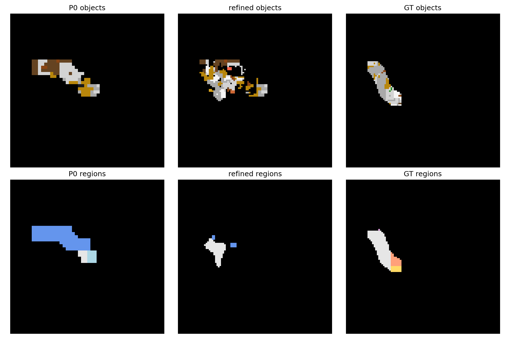
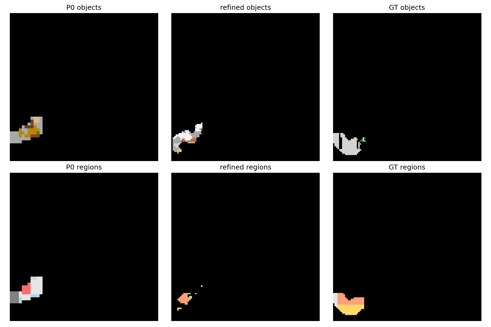
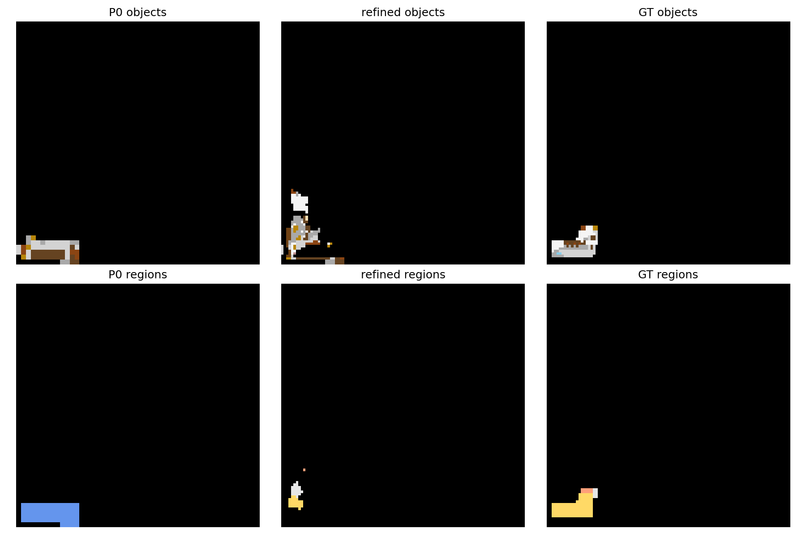

# S3 Refiner 训练报告

## 1. 训练设置

- 代码提交：`1f3fcc6 feat: train and evaluate cognitive map refiner`
- 设备：单卡 GPU 0
- 训练轨迹：18,882 条；每个 epoch 实际采样 110,004 个 step
- `object_pos_weight`：固定 `seed=0` 随机抽取 2,000 条训练轨迹，使用全部 step，共 20,941 个样本
- 验证集：`val_seen` 5,886 个 step；`val_unseen` 13,930 个 step
- 超参数：batch size 32、学习率 `3e-4`、AdamW、cosine、10 epoch、每轨迹最多 6 step、AMP、BCE with logits、8 个 DataLoader workers
- best checkpoint 选择指标：`val_unseen / 100×100 / route_seen / object mIoU`

## 2. 训练曲线与耗时

| Epoch | Train loss | 耗时（秒） |
|---:|---:|---:|
| 1 | 0.044366 | 413.47 |
| 2 | 0.022724 | 388.23 |
| 3 | 0.020824 | 397.55 |
| 4 | 0.019276 | 400.28 |
| 5 | 0.018090 | 384.87 |
| 6 | 0.017167 | 407.26 |
| 7 | 0.016418 | 377.64 |
| 8 | 0.015841 | 406.24 |
| 9 | 0.015447 | 390.34 |
| 10 | 0.015233 | 393.37 |

总耗时 3,959.26 秒，即约 65.99 分钟。best epoch 为第 3 轮，best 指标为 14.2574%。第 3 轮之后训练 loss 继续下降，但验证指标下降，存在过拟合趋势。

## 3. Best epoch 指标

以下数值均为 mIoU 百分比。

### 3.1 val_unseen：100×100

| 分组 | P0 object | Refined object | P0 region | Refined region |
|---|---:|---:|---:|---:|
| seen | 2.82 | 10.87 | 5.89 | 8.98 |
| unseen | 0.75 | 0.75 | 1.56 | 2.13 |
| route | 3.76 | 11.38 | 7.61 | 8.43 |
| route_seen | 3.99 | **14.26** | 8.11 | 10.07 |

### 3.2 val_unseen：10×10

| 分组 | P0 object | Refined object | P0 region | Refined region |
|---|---:|---:|---:|---:|
| seen | 10.45 | 25.27 | 12.58 | 17.06 |
| unseen | 4.78 | 4.78 | 6.80 | 6.56 |
| route | 11.63 | 25.32 | 13.87 | 16.21 |
| route_seen | 11.79 | **29.38** | 14.23 | 17.81 |

### 3.3 val_seen：100×100

| 分组 | P0 object | Refined object | P0 region | Refined region |
|---|---:|---:|---:|---:|
| seen | 10.45 | 23.43 | 18.55 | 21.74 |
| unseen | 4.89 | 4.89 | 7.06 | 8.90 |
| route | 14.90 | 26.11 | 23.58 | 20.97 |
| route_seen | 14.74 | **29.95** | 24.63 | 24.05 |

### 3.4 val_seen：10×10

| 分组 | P0 object | Refined object | P0 region | Refined region |
|---|---:|---:|---:|---:|
| seen | 22.49 | 38.57 | 27.83 | 31.13 |
| unseen | 12.61 | 12.61 | 17.20 | 17.56 |
| route | 26.80 | 41.00 | 31.62 | 30.67 |
| route_seen | 26.55 | **43.94** | 31.66 | 32.48 |

## 4. 严格断言

合成后的 refined map 在 unseen 区域直接保留 P0 object 通道。训练过程中逐 batch 检查张量严格相等，并在累计指标后再次检查逐类 intersection/union 严格相等，全部通过：

| 验证集 | 分辨率 | P0 unseen object mIoU | Refined unseen object mIoU | 结果 |
|---|---:|---:|---:|---|
| val_unseen | 100×100 | 0.007549232947 | 0.007549232947 | 完全相等 |
| val_unseen | 10×10 | 0.047789376813 | 0.047789376813 | 完全相等 |

## 5. 输出文件

- `data/refiner/checkpoints/best.pt`
- `data/refiner/checkpoints/last.pt`
- `data/refiner/checkpoints/metrics.json`

## 6. val_unseen 末步可视化

每张图的列为 P0、refined、GT；行为 object、region；六个面板共用同一颜色映射。

### Episode 1006

### Episode 1078

### Episode 1204

## 7. 结论

- Refiner 显著提高了已观察区域的 object mIoU，说明视觉证据能够修正 P0。
- unseen object 与 P0 严格一致，符合“只修改已观察 object 区域”的合成规则。
- region 在部分分组上下降，尤其是 `val_seen / route / 100×100`；后续进入导航评测前应保留这一风险判断。
- 本阶段停在 S3，未进入 S4。
